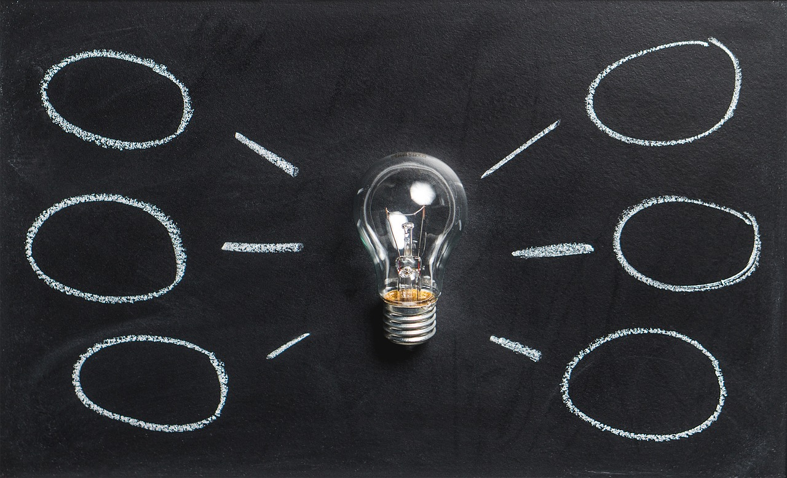
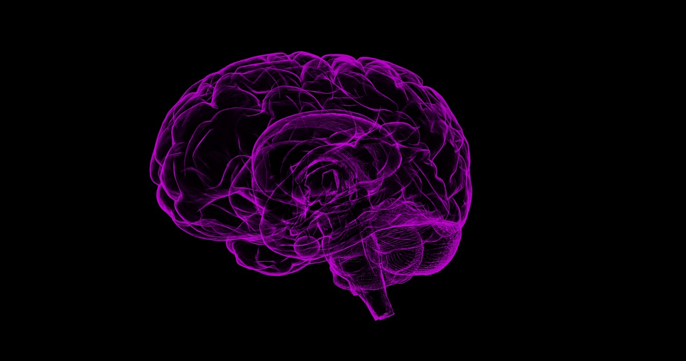
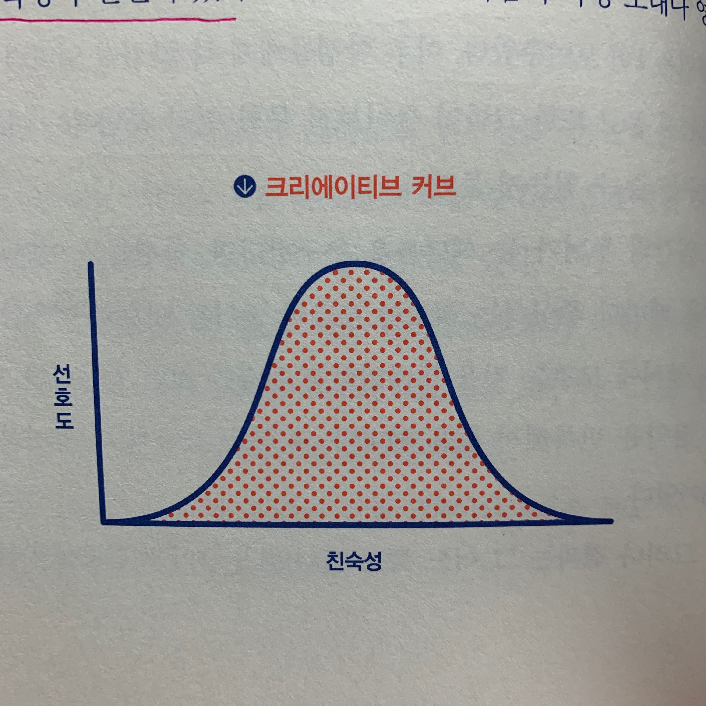
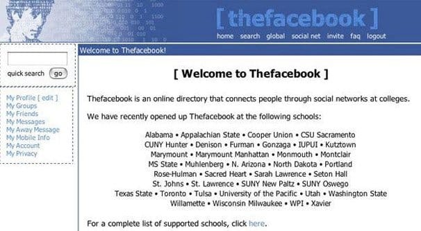
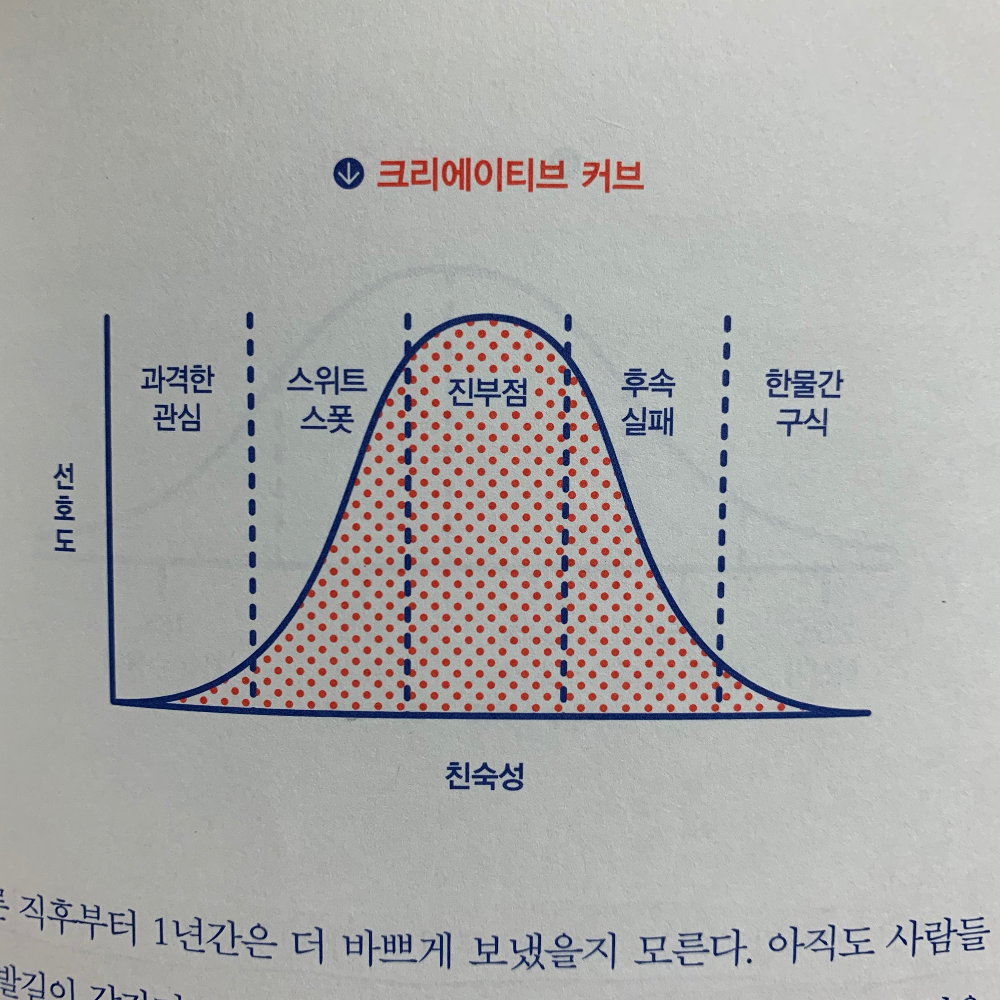
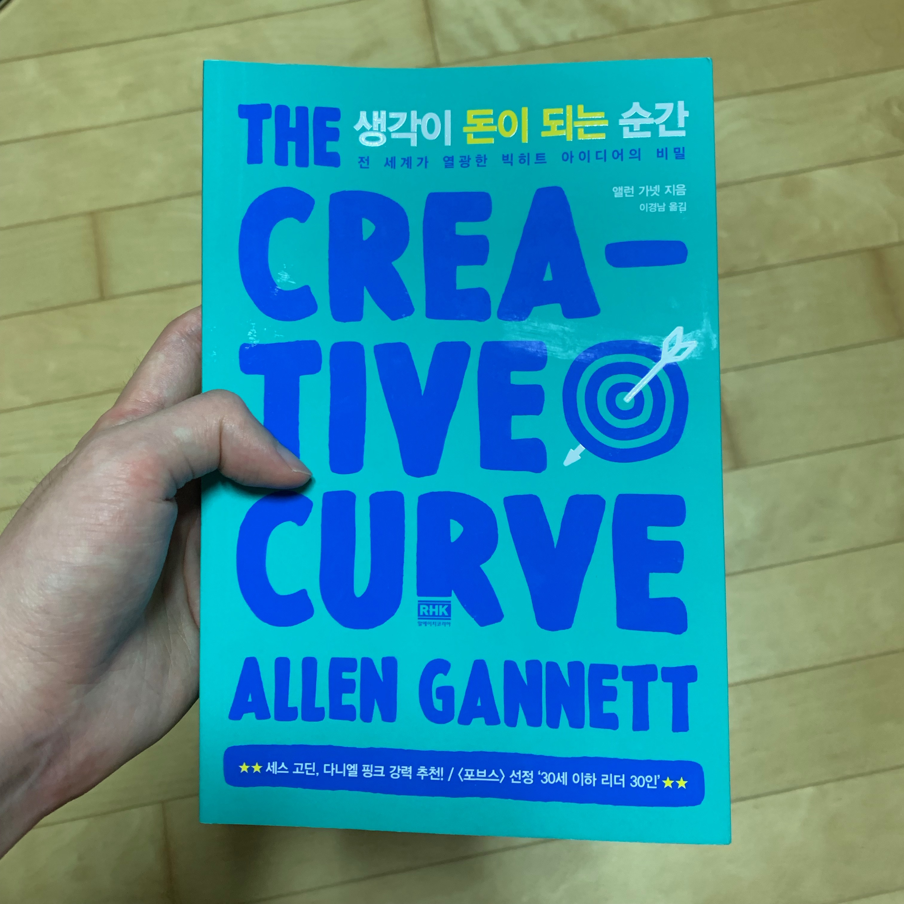

많은 사람들이(책을 읽기 전 나를 포함해서) 창의성에 대해 '타고나는 것이다, 예술에 종사하는 사람만 특히 발달되어 있다' 등등 내가 아닌 소위 말하는 **천재**에게 주어지는 특성이라고 여기곤 한다. 책 **생각이 돈이 되는 순간(원제: The Creative Curve)**에서는 이러한 의견들이 역사적으로 전해져 내려온 것이라 설명한다. 
> 찰스 다윈의 <자연 선택에 의한 종의 기원에 대하여>라는 책은 창의성과 천재의 과학적 진화의 뿌리를 탐구하려는 노력의 기폭제가 되었으며, <유전적 천재>, <천재적 인간>, <천재의 광기> 등을 비롯한 소위 광기 어린 천재의 과학적 기원에 대한 책들이 수없이 나와 주류 학계의 관심을 끌었다 ...중략... 이러한 책들 때문에 19세기 말 과학자나 일반 대중은 천재성을 질병에 의해 조장하거나 강화할 수 없는 타고난 유전적 특성으로 보았다.

즉, 광기 어리거나 혹은 정말 독특한 천재들만이 위대한 창작품을 만들 수 있고 개인의 창의성과 천재성은 바꿀 수 없다는 것이다. 과연 정말 그럴까?

## 천재는 타이밍이다
저자는 `천재란 객관적 지표에 근거해 부여받는 라벨이 아니다` 라고 말한다. 천재라고 여겨지려면 대중이 그들의 혁신을 받아들여야 한다. 달리 말해, 어떤 작품이 '창의적'이라는 호칭을 받으려면 다른 사람들이 인정해주어야 하고 심지어 천재라는 호칭을 받으려면 상당히 많은 사람으로부터 인정받아야 한다. 즉 이것은 하나의 **사회적 현상**이라고 할 수 있다. 그렇다면 무엇을 보고 창의적이라는 라벨을 붙일 수 있을까? 심리학자 칙센트미하이는 다음 세 요소를 갖추어야 한다고 말한다.
1. **소재**: 대부분의 환경에서 소재는 표준으로 간주되는 규범이자 관습이며 과거의 창의적 산물을 말한다. 예를 들어 뭔가 참신한 곡을 만들려면 이미 있는 것부터 알아하는 것이다. 
2. **문지기**: 어떤 유형의 창의성이 소재에 속하는지 여부를 판단하는 기준을 말한다. 예를 들어 미술 분야에서 문지기는 화랑 주인이나 미술 평론가, 박물관 큐레이터 등이다. 팝 음악에서는 매니저나 프로듀서, 레코드 회사 간부들이라고 할 수 있다.
3. **개인**: 개인은 기교적인 재능뿐 아니라 미디어와 문지기의 관심을 끌 수 있는 실질적 속성을 갖춰야 한다. 그들의 작품이 가치가 있다는 것을 다른사람에게 설득할 능력은 창작품의 성공여부를 좌우할 정도로 중요하다.

이 세 가지 요소는 개인이나 작품이 창의적이라는 호칭에 어울리도록 조율되어야 한다. 칙센트미하이에 따르면 "독청상이나 참신한 인식, 발사하는 사고 능력은 모두 바람직한 개인적 특성으로 여겨지며 이러한 인식을 딱히 거부할 이유가 없다. 그러나 대중이 인정해주지 않는다면 그런 요소도 창의성을 구성하지 못하고 천재 역시 만들어내지 못한다" 이 모든 것이 **창의성과 천재가 사회적 현상이라는 사실**을 다시 한번 상기시킨다. 창작자는 대중의 인정을 받아야 한다. 그래서 **타이밍**이 중요하다. 자원이 있고 문지기가 관심을 가질 때 작품을 생산하고 창작해야 하는 것이다. 판매 기술을 연마하고 자신의 창의적 영역을 뒷받침할 환경을 꾸미는 책략도 필요하지만, 무엇보다 **적절한 시기에 적절한 아이디어**를 내야 한다. 그렇다면 이 **타이밍**이란 것은 어떻게 알 수 있을까?

## 친숙함과 색다름
그전에 사람들이 '무언가'를 대할 때 두뇌에서는 **친숙함**과 **색다름**이 서로 줄다리기를 하고 있다는 점을 알아야 한다. 상대방과의 만남을 거듭할수록 호감을 갖게 되는 사회적인 현상인 <a href="https://ko.wikipedia.org/wiki/%EB%85%B8%EC%B6%9C_%ED%9A%A8%EA%B3%BC" target="_blank">단순 노출 효과</a> 이론으로 유명한 심리학자 자이언스는 이 효과가 예술 세계에선 어떻게 동작하는지 알기 위해 일련의 실험을 진행했다. 먼저 참가자들에게 추상화 같은 다양한 그림의 복제품을 각각 0, 1, 2, 5, 10, 25번씩 보여줬다. 그리고 참가자들에게 그림에 각별한 관심을 가지고 감상하도록 요청한 후, 각 그림에 대해 "너무 싫다"부터 "아주 좋다"까지 7단계로 평정을 매기게 했다. 단순 노출 효과에 따르면 그림을 보지 않았거나 적게 본 사람은 그림에 대해 두렵다고(친숙하지 않다고)느끼지만, 많이 본 사람일 수록 각 그림에 대한 두려움이 줄어들면서(친숙성이 올라가면서) 자연스럽게 **호감도**도 올라갈 것이라 예상할 수 있다. 하지만 25번 본 그림에 대한 참가자들의 호감도는 처음 본 그림에 비해 약 15% 낮았다. 다시 말해 학생들은 친숙한 그림보다 참신한 그림을 더 좋아했다. 이는 두뇌의 신경전달물질인 **도파민**과 아주 깊은 연관이 있다. 

도파민은 사람들로부터 가장 많은 오해를 받고 있는 두뇌의 화학물질 중 하나로, 흔히 '쾌락 신경전달물질'로 알려져 있다. 그러나 도파민은 이보다 훨씬 더 미묘하고 복잡하다.
인간의 동기에 관한 연구로 유명한 신경과학자 엠라 뒤젤은 이렇게 말한다. "도파민은 어떤 것을 소비하는 쾌락과 관련된 물질이 아닙니다. 중요한 것은 어떤 것을 얻으려는 **동기**의 문제이고 그것을 알려주는 것이 도파민입니다." 즉, 도파민은 '동기' 신경전달물질인 것이다. 그리고 중요한 것은 **색다름**이란 것이 도파민을 방출하여 앞에 놓인 대상에 더 많은 관심을 두고 대상에 대해 더 많은 것을 알아내도록 조장한다는 것이다. 결론적으로 인간은 색다른 것에 자극을 받으면서 또한 낯선 것을 두려워한다. 어떻게 해야 관심과 걱정의 균형을 맞출 수 있을까?

저자는 친숙성과 색다름을 둘 다 추구하는 인간의 성향은 **선호도**와 친숙성에서 종형 곡선의 관계를 보인다는 것을 발견했다. 이 종형 곡선이 바로 **크리에이티브 커브(Creative Curve)**다. 또한 **적절한 시기에 적절한 아이디어를 내는 것** 즉 **타이밍**은 이 곡선 위에서의 특정 지점인 것이다. 이 타이밍에 대한 적절한 사례로, 우리가 자주 사용하며 이제는 없어선 안될 SNS의 시초 기업에 대한 이야기를 들 수 있다.

## SNS의 시작
2004년 초에 실명을 사용하는 최초의 소셜 네트워크 서비스가 나왔다. 
많은 분들이 페이스북이라고 예상하실 텐데, 한국인들에겐 생소한 **캠퍼스 네트워크**라는 서비스의 이야기다. 캠퍼스 네트워크는 페이스북보다 몇 주 일찍 시작됐을 뿐 아니라 극적인 비약을 보인 SNS였다. 페이스북은 초창기에 그저 프로필과 친구 찜하기 기능이 전부였지만 캠퍼스 네트워크는 지금의 페이스북이 자랑하는 뉴스 피드(캠퍼스 네트워크는 액티비티 피드였다), 사진 공유 기능, 코멘트 기능 등이 이미 갖춰져 있었다. 그러나 이러한 좋은 기능들에도 불구하고 캠퍼스 네트워크는 별다른 호응을 얻지 못하며 실패의 길을 걷게 됐다.

캠퍼스 네트워크의 기능들은 나중에 페이스북에 엄청난 성공을 가져다 준 기능들이다. 어찌보면 선견지명을 가졌다고도 볼 수 있는 것이다. 하지만 그들은 페이스북에게 처참히 패배하며 실패의 길을 걷게됐다. 무슨 이유 때문일까?

2004년 당시의 페이스북 페이지

## 크리에이티브 커브에 올라탄 페이스북
캠퍼스 네트워크의 설립자였던 웨인 팅은 그의 **앱이 가지고 있던 특징들의 밀도**가 페이스북보다 우월하다고 생각했지만, 실제로는 그것이 **실패의 핵심 요인**이었다고 결론 내렸다. 당시 온라인 사용자들은 여전히 가명을 사용했는데, 캠퍼스 네트워크는 실명을 사용하도록 요청했을 뿐 아니라 사진을 공유하고 업데이트를 하도록 요구했다. 이와 다르게 페이스북은 유저들에게 온라인에서 정보를 공유하는 행위를 편안하게 느끼도록 해주면서 다른 기능들을 조금씩 추가해나갔다. 웨인 팅은 인터뷰에서 이렇게 말했다. `우리는 한꺼번에 너무 많은 비약을 요구했어요 ...중략... 페이스북이 놀라울 정도로 스마트했던 점은 친구 맺기와 찜하기로 사람들을 낚은 다음, 유저들의 심리를 파악해가면서 천천히 기능을 추가하여 이를 점점 더 편안하게 느끼도록 만들었다는 점입니다.` 즉, 마크 주커버그와 그의 페이스북 팀은 **크리에이티브 커브**를 따라가고 있었다.

사람은 무언가에 노출될수록 처음 접했을 때와 달리 두려움이 점점 사라지면서 이 새로운 것이 혹시 가치 있는 것은 아닐지 궁금해지기 시작한다. 저자는 이 시점을 크리에이티브 커브의 **스위트 스폿(Sweet Spot)**이라 부른다. 스위트 스폿에 있는 아이디어는 편안하다고 느낄 만큼 친숙하면서도 동시에 계속 관심을 유발할 만큼 색다르다. 페이스북은 이 지점에 있도록 그 당시 생소했던 기능들을 최대한 덜어내어 사람들의 관심을 유지시켰다. 적절한 타이밍의 아이디어가 그들을 성공의 길로 이끈 것이다.

하지만 아이디어에 대한 지속적인 노출이 이어지면 점점 대상에 대한 관심이 줄어들고 결국에는 더 이상 별다른 보상이 따르지 않는 순간이 온다. 다시 말해 **진부점(Point of Cliche)**에 도달하는 것이다. 이제는 페이스북의 뉴스 피드, 사진 공유, 좋아요 등은 우리에게 매우 친숙한 아이디어가 됐지만 그 자체만으로는 사용자들에게 색다름을 주지 못한다. 다만 페이스북 자체는 이미 우리에게 친숙한 것이 됐고 이를 대체해서 사용할 서비스는 아직 나오지 않았다. 그래서 우리는 여전히 페이스북을 사용하며, 그들은 수많은 사용자층을 토대로 새로운 사업들을 확장해 나가고 있다.

## 정리
우린 옛날부터 창의성과 천재 혹은 예술가들에 대해 오해를 가지고 살아왔다. 좀 더 비관적인 사람은 '나는 절대 창의적인 사람이 아니고 예술가 또한 될 수 없다'고 자신을 단정지어 버린다. 하지만 오늘날 '크리에이터' 라는 직업아닌 직업으로 많은 사람들이 무언갈 창조하며 살아가고 있는 모습을 볼 수 있다. 옛날엔 미술, 음악 등 예술적인 것에 한정되어 창의적이라는 라벨을 달았지만 지금은 '컨텐츠' 라는 좀 더 넓은 범주에 그 라벨을 달 수 있게 되었다. 하지만 변하지 않는 것이 한 가지 있는데, **결국은 작품이 사회적으로 인정받아야 성공하며 이는 타이밍이 맞아야 한다**는 것이다. 이 책은 그 타이밍이 언제인지 뿐만 아니라 창의적인 작품을 만들기 위해 해야하는 구체적인 행동 법칙들을 자세히 알려준다. 개발자이자 미래에 창의적인 서비스로 나의 사업을 하고 싶은 나로써는 많은 도움이 되었고 필요할 때마다 재독을 하며 알게된 것들을 상기시킬 생각이다. 역시나 좋은 책을 추천해준 체인지 그라운드에게 감사드리면서 글을 마친다.

