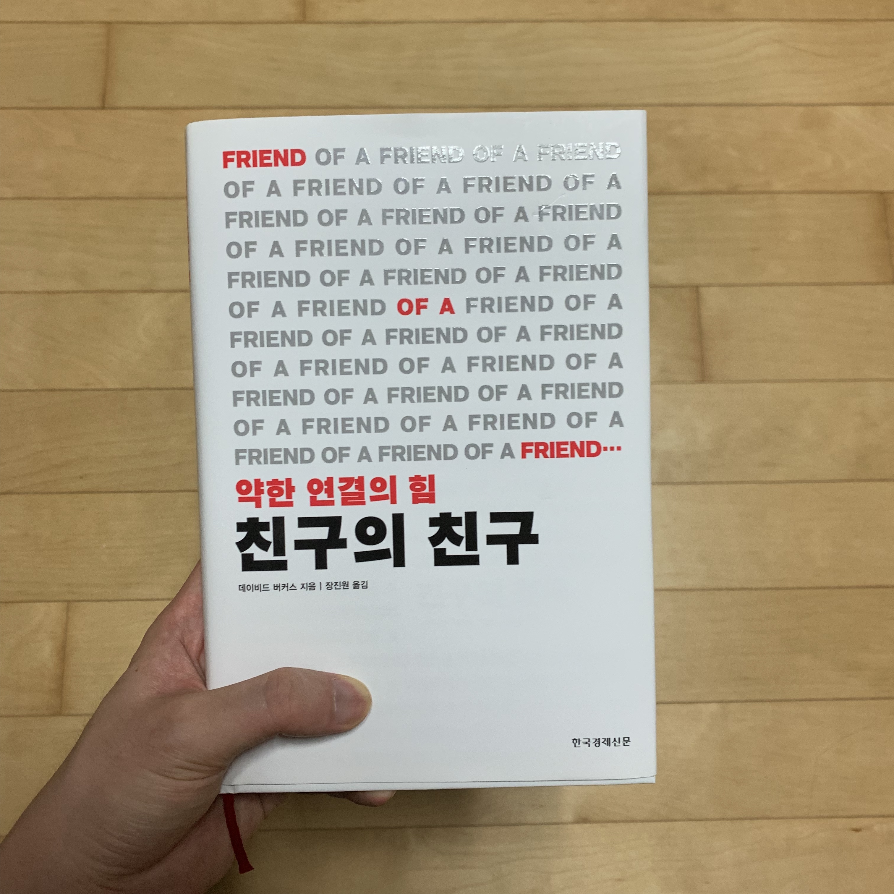

내가 지금까지 인간관계를 맺는데에 있어서 지켜오려고 노력했던 하나의 가치관이 있었다. '지인을 늘리는데에 집중하는 것보다 잘 맞는 친구 몇 명과 더 깊은 관계를 가지는데 집중하는 것이 더 현명한 인맥 관리 방법이다' 가 그것이다. 약한 유대관계(지인 등)는 그 관계가 언제든 끊어질 수 있지만 강한 유대관계(친구, 가족 등)는 그 관계가 계속 유지될 확률이 높고 나에 대해 더 잘 알기 때문에 결국 나에게 도움이 되는 관계는 강한 유대관계일 것이라는 생각 때문이었다. 하지만 이 가치관에 대해 다시 생각해보게 한 책이 바로 이 <친구의 친구>라는 책이다.

## 약한 유대관계
대부분의 사람들이 해결해야 할 문제에 직면하거나, 선택의 갈림길에 서거나, 갑자기 새로운 직장을 찾아야 할 때, 친구들이나 가족, 신뢰하는 동료들에게 조언을 얻곤 한다. 이러한 강한 유대관계의 사람들은 당신을 가장 잘 알고 도와줄 의지 또한 크다. 하지만 저자 데이비드 버커스는 강한 유대관계의 조언은 당신이 미처 모르고 있는 유용한 정보나 실마리를 가지고 있을 가능성이 아주 낮아 혼자서 충분히 생각해 볼 수 있는 비슷한 조언을 할 가능성이 크다고 말한다. 덧붙여 **오히려 약한 유대관계에게서 새로운 기회와 정보를 얻을 수 있다**고 말한다. 

> 약한 유대관계들은 전혀 다른 출처에서 유래한 아이디어를 조합함으로써 더 많은 실험을 할 수 있게 하며, 강한 유대관계들보다 사회적 관심이나 대세에 따라야 한다는 부담이 덜합니다. <친구의 친구>

엄청 친하고 자주 만나는 사이일수록 같은 정보와 환경을 공유한다. 그래서 내가 어떤 문제에 직면했을 때 나와 같은 생각과 의견을 가질 확률이 높다. 그에 비해 약한 유대관계의 인맥은 대체로 다른 인맥 집단에서 활동하며 다른 정보를 얻는다. 그 결과 당신이 처한 딜레마를 해결하는 데 더욱 창의적이고 생각하지 못할 정보를 제공해준다.  

## 휴면 유대관계
하지만 약한 유대관계는 명백한 단점이 두 가지가 있다. 돕고자 하는 의지가, 강한 유대관계에 비해 약하다는 것과 당신에 대해 잘 모를 수 있다는 것이다. 특히 알게된 지 얼마되지 않은 관계에선 더욱 그렇다. 

그러나 약한 유대관계 중에서도 어떤 것들은 새로운 정보를 제공하면서도 우리를 돕고자 하는 선의가, 강한 유대관계만큼 강할 수도 있다. 과거엔 꽤 끈끈했지만 시간이 지나면서 약해진 경우가 그렇다. 이 관계를 **휴면 유대관계** 라고 부른다.

대니엘 레빈, 호르헤 월터, 키스 머니건은 거의 10년 동안 휴면 상태였던 유대관계가 어떤 힘을 가지는지 연구해왔다. 그중에서도 특히 기업 임원들에 대한 설문조사를 하면서 과거의 인맥을 재활성화하도록 요청하고 그 결과를 관찰했다. 그들에게 연락이 끊기기 전 강한 유대관계를 유지했던 한 사람과 약한 유대관계였던 또 한 사람에게 연락하여 회사의 주요 프로젝트에 조언을 얻고, 그 조언을 실현 가능성, 참신성, 신뢰성, 공감의 정도를 기준으로 평가하게 했다.

먼저 임원의 상당수가 옛 동료에게 전화를 걸어 조언을 구한다는 것을 달갑게 생각하지 않았다. 하지만 거의 모든 임원들이 휴면 상태의 인맥에게서 엄청난 가치를 얻었다고 답변했다. 예상치 못할 통찰력이나 참신한 조언을 해줄 확률 역시 휴면 상태의 인맥 쪽이 현재 인맥보다 훨씬 더 높았다. 연구자들은 이와 같이 휴면 유대관계가 힘을 발휘하는 세 가지 주요 이유를 알려준다. 

1. 휴면 상태의 인맥은 약한 유대관계의 인맥과 마찬가지로 새롭고 다르며 예상치 못한 식견을 풍부하게 가질 수 있다.
2. 여러 개의 프로젝트로 정신없을 수도 있는 현 동료들과 대화하는 것보다 더 빠르다.
3. 돕고자 하는 의지와 신뢰가, 약한 유대관계의 인맥보다 더 강하다.

누군가와 연락이 끊겼다고 해서 그 사람이 세상에서 사라졌다는 뜻은 아니다. 오히려 그 휴면 인맥은 다른 사회적 집단들과 어울리며 새로운 경험을 하고 있다. 그 경험들이 새로운 통찰력의 원천이 되어 더 가치있는 조언을 해줄 가능성이 크다. 그렇다면 어떻게 휴면관계와 다시 연락을 시작해 볼 수 있을까?

## 실천으로 옮기기
책 <친구의 친구>는 각 장의 주제에 대해 구체적인 실천 방법을 제시한다. 이 책에서 제시한 약한 유대관계의 인맥과 정기적으로 연락을 주고받는 방법은 다음과 같다.

1. 과거에 강한 유대관계였지만 연락이 뜸해지거나 끊긴 직장 동료 6~10명의 리스트를 만들어라.
2. 그 리스트에서 무작위로 한 명을 골라 이메일을 보내거나 전화를 걸어 직접 만나거나 얘기를 나누자고 제안해라.
3. 만나는 것에 대한 구체적인 이유를 정하지 말고 일단 단지 연락을 주고받고 싶을 뿐이라고 말해라. 얘기를 나누는 도중에 자유롭게 일과 관련된 사건이나 문제, 기회들을 얘기하라.
4. 얘기한 것들을 잘 정리해서 적어두고 당신에게 도움이 필요하거나 당신이 그를 도울 수 있는 것들에 대해 대화를 계속 이어가라.

## 정리
연구에 참여한 임원들처럼 대부분 사람은 자신이 신뢰하는 소규모 집단 내에서 조언을 얻거나 대화하는 것을 선호한다. 즉 새로운 정보의 혜택을 제공할 확률이 더 낮은 사람들을 다시 찾는 성향을 가지고 있는 셈이다. 이는 **인간이 본능적으로 사회적인 이득을 위해 연락을 하는 것을 불편하다고 생각하는 경향**을 가진 다는걸 보여준다.

하지만 이 책에서 약한 유대관계의 이점에 대한 충분히 많은 연구 결과와 데이터를 제시하면서, 우리가 좀 더 성공적인 삶을 살기 위해선 인간의 이러한 사회적 본능을 극복해야 한다고 말한다. 새로운 인간관계를 맺는데 많은 에너지를 소비하는 것이 걱정이라면, 자신의 인적 네트워크에 있는 오래된 휴면 상태의 인맥으로 이를 극복할 수 있다.

인맥 관리를 한답시고 자신과 연락한지 오래된 사람들을 연락처에서 지우고 있다면, 이는 자신의 잠재적인 성공 파트너를 잃고 있는 것일지도 모른다. 이 책은 인맥 관리란 이 사람이 나에게 이득이 되는 사람인가 따지는 것이 아닌 서로가 도움이 될 수 있는 방법을 찾고 그 안에서 가치를 발견하는 것이라고 독자에게 친절하게 알려준다. 당신이 만약 네트워킹 자체에 대해 부정적으로 생각하고 있다면 이 책을 통해 조금 다른 관점으로 생각해 볼 수 있다고 자신할 수 있다. 또한 각 장에 네트워킹에 대한 구체적인 실천 방법들이 잘 정리되어 있어, 당장 네트워킹을 어떻게 해야할 지 막연한 분들에게 큰 도움이 될 것이다.