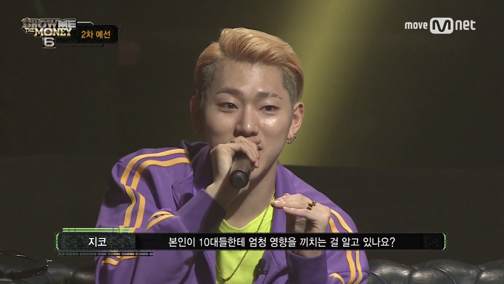
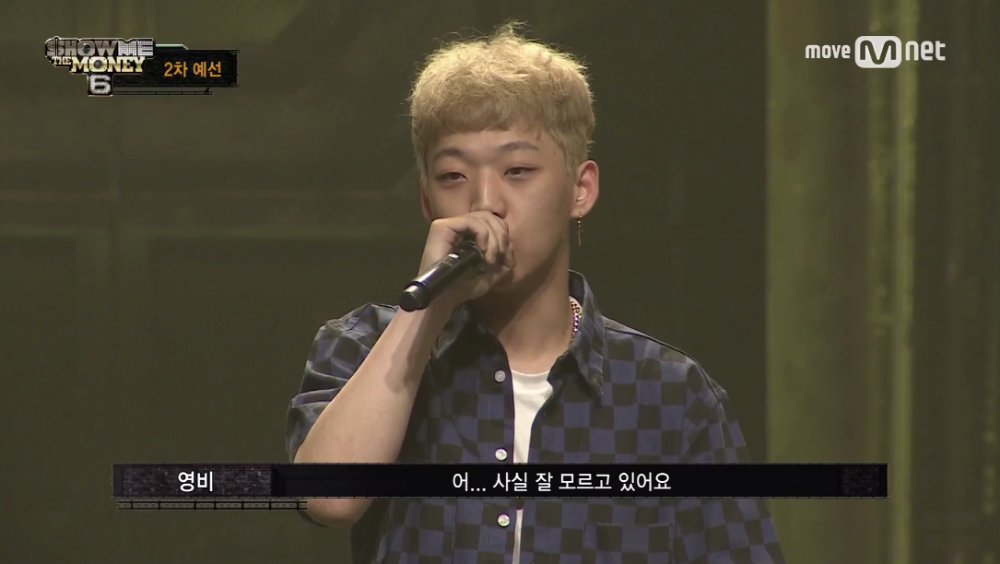
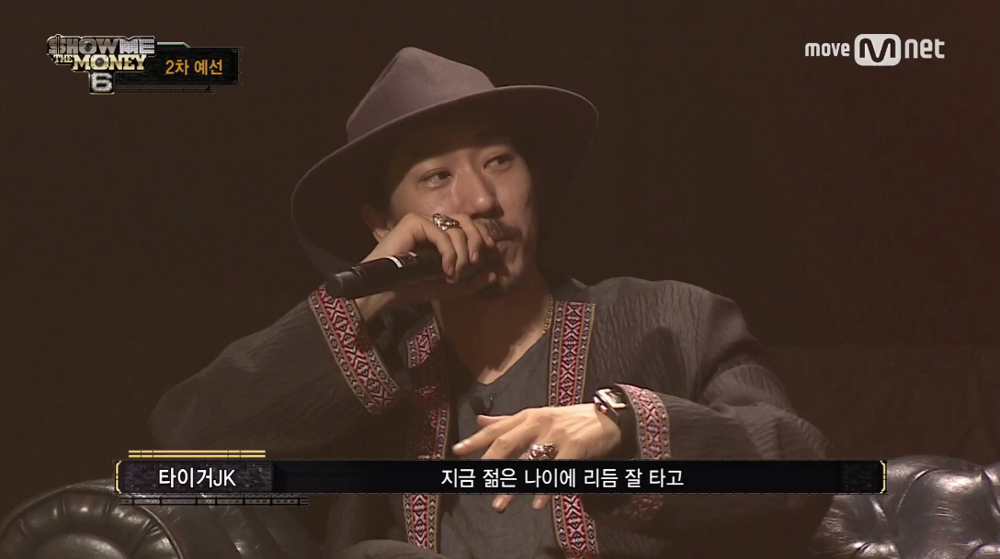
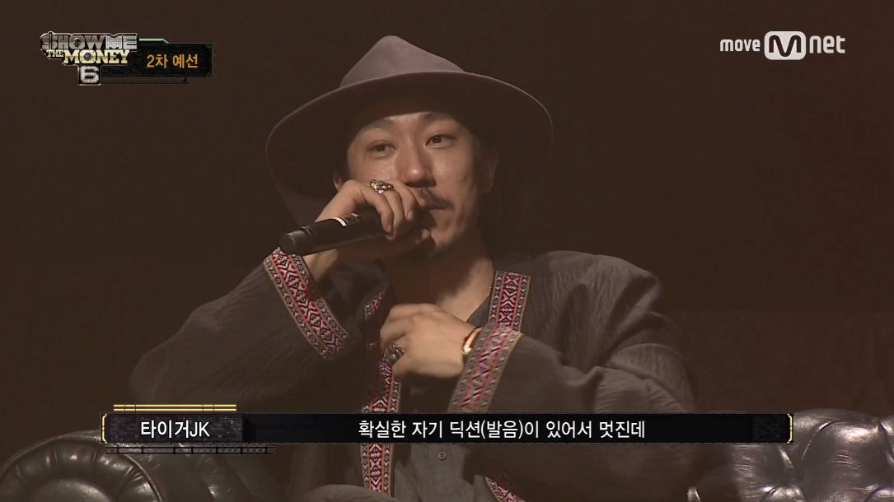
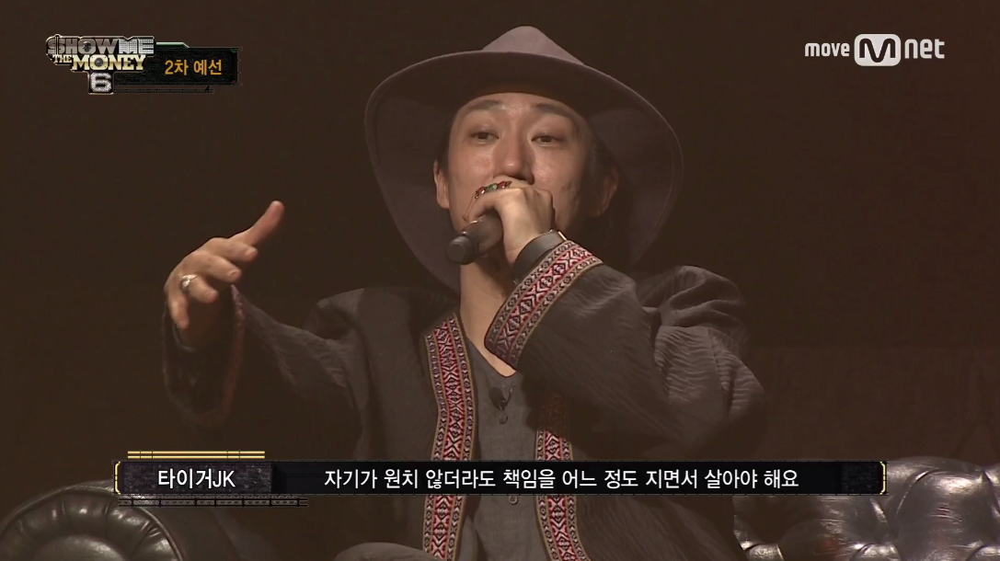
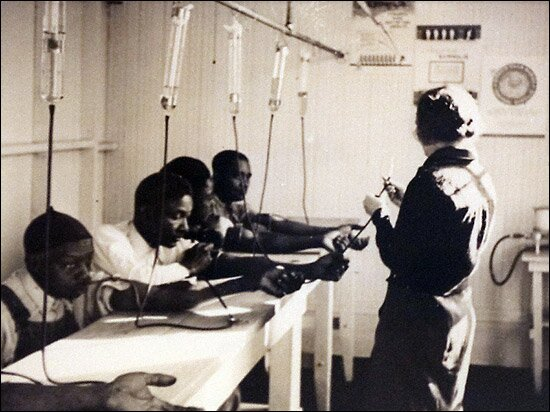
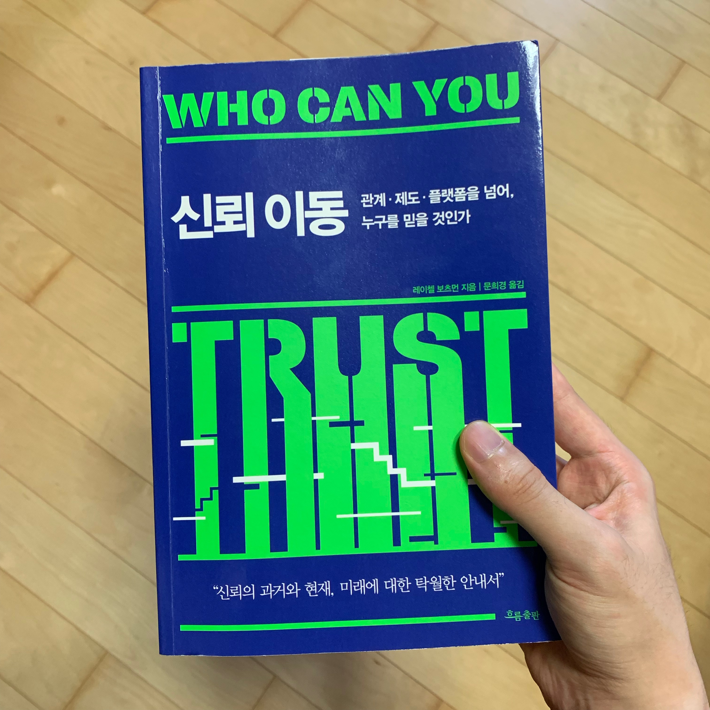

> 개인의 행동이 어떤 결과를 낳고 궁극적으로 어떤 책임이 따르는지 좀 더 진지하게 고민해야 한다. <신뢰 이동>

난 '쇼미더머니' 라는 힙합 경연 프로그램을 매 시즌 챙겨본다. 현재 시즌8이 절찬리에 방영중이다(이 글을 다 쓰면 어제 못본 3화를 볼 예정이다ㅎㅎ). 왜 뜬금없이 쇼미더머니를 언급하냐면 위에 언급한 문구를 보고 재작년에 방영된 시즌6의 한 장면이 떠올라서다.

영비는 쇼미더머니 시즌6 이전에 방영됐던 '고등래퍼'라는 청소년 힙합 경연 프로그램에 출연했는데, 트위터, 페이스북, 인스타, 디시인사이드 등 각종 SNS와 인터넷 커뮤니티에서 그가 **학교 폭력 가해자**였다는 것이 알려지며 고등래퍼 하차에 대한 논란이 있었다. 하지만 고등래퍼 측에서 '실수를 인정하고 깊이 뉘우치며 반성하고 있다.'며 그를 대변해주었고, 결국 그는 우수한 실력으로 고등래퍼 우승까지 거머쥘 수 있었다. 위 장면들은 그 이후 쇼미더머니 시즌6에도 출연해 2차 심사를 받고 있는 장면이다. 영비가 랩을 다 끝내고 다른 심사위원들은 다 Pass를 줬지만 타이거 JK 혼자 Fail을 줬다.

## 신뢰와 책임감

학교폭력 논란에도 불구하고 뛰어난 실력과 자신감 넘치는 모습으로 영비는 당시 10대들의 아이콘이 되었다. 하지만 일반 대중들은 학교폭력 가해자가 성공하는 모습이 사회적으로 끼칠 영향에 대해 우려의 목소리를 내기 시작했다. 타이거 JK도 그의 말과 행동들이 대중들(특히 10대)에게 긍정적이든 부정적이든 어떠한 영향을 끼칠 것이라고 생각해서 저런 충고를 했던 것 같다.

> 자기가 원치 않더라도 책임을 어느 정도 지면서 살아야 해요.

나는 타이거 JK가 영비에게 참 시기적절한 충고를 해줬다고 생각한다. 우리가 어떤 일을 할 때 책임감을 가지는 건 정말 중요하다. 특히 요즘같이 인터넷으로 기록이 남기 쉬울 때 내가 했던 말, 행동들은 기록될 수 있다. 그 기록들이 훗날 누군가에게 나에 대한 신뢰가 깨지게 될 수 있다는 것이다.

영비는 공식적으로 사과를 했지만 이후 내놓는 곡마다에 별점 테러를 당하기 시작했다. 사람들이 그의 인성에 대하여 신뢰를 잃은 나머지, 곡 자체도 나쁘게 평가하기 시작한 것이다. 특히 학교폭력은 대중들에게 매우 민감한 문제이기 때문에 그 여파는 꽤 컸다.

## 신뢰를 잃는다는 것

책 <신뢰 이동> 에서도 신뢰를 져버린 한 사건이 어떤 결과를 낫는지 경악스러운 한 사건을 예시로 보여주고 있다. 1932년부터 1972년까지 미국에서 매독 발병률이 가장 높았던 터스커기 카운티의 아프리카계 미국인 600명이 미국공중위생국에 의해 **인간 실험체**로 이용당한 사건이 있었다. 실험에 이용된 사람들은 대부분 문맹이었던 흑인 농부들로 매우 고통스럽다는 요추천자(뇌척수액을 뽑는 수술)를 받고 매일 피를 뽑히다 사망하면 해부까지 당했다. 의사들은 흑인 농부들에게 그저 '나쁜 피'를 치료한다고만 알려줬다. 사실 이 실험의 주요 목적은 **매독의 장기적 증상을 관찰하고 흑인에게 미치는 영향이 백인에게 미치는 영향과 동일한지 알아보는 것**이었다.

진 헬러라는 젊은 기자는 미국 정부가 40년 이상 숨기며 자행한 이 끔찍한 실험을 기사로 작성해 널리 알렸다. 실험은 즉각 중단됐고 정부 고위층들은 국민들에게 사죄하는 기자회견을 열었다. 그로부터 몇십년이 지난 최근에 **흑인 남성은 백인 남성보다 기대수명이 낮다**는 연구결과가 발표됐다. 연구를 담당한 레버넬 박사는 `다수의 흑인 남성이 터스커기 실험으로 인해 병원에 대해 공포와 불신, 무례, 불필요한 불쾌함과 연관 짓는 것으로 나타났다.`며 이와 같은 결과가 나온 이유를 설명했다. 즉, 오랫동안 병원에 대한 불신이 마음속에 자리잡아 병에 걸려도 웬만해서는 병원에 가지 않는다는 것이다. 또한 의사보다 이발사를 신뢰한다는 결과까지 나왔다고 한다.

> 규제 조치와 윤리 기준이 마련된 뒤에도 상황은 좀처럼 달라지지 않았다. 터스커기 실험의 여파가 계속 남아서 일부 사람들의 판단에 영향을 미친 것이다 ...중략... **신뢰를 깨트리는 사건 하나가 한 세대 전체에 상처를 입혀서 이를 치유하는데 수십 년이 걸릴 수도 있다는 점이다.** <신뢰 이동>

## 정리

신뢰는 우리의 모든 생활 속에 깊숙이 자리잡고 있다. 어떤 것을 신뢰하고 신뢰하지 않느냐에 따라 그 사람의 인생이 크게 달라지기도 한다. 반대로 주변 사람들, 혹은 연예인이라면 대중들에게 어떤 신뢰를 주느냐에 따라서도 변한다. 터스커기 실험처럼 몇십년이 지나고서 기사를 통해 밝혀지는 것은 옛날 일이다. 오늘날엔 SNS나 인터넷 커뮤니티로 빠르게 전파되면서 개개인이 하는 말 하나하나가 증거가 되고 증거들이 모여서 그 사람에 대한 새로운 신뢰 혹은 불신이 된다. 중요한 것은 옛날이나 지금이나 **신뢰는 거의 모든 행위와 관계의 근간**을 이룬다는 것이다. 단지 오늘날에는 그 신뢰를 증명하고 증명받는 속도가 빨라졌을 뿐이다.

## 책에 대한 소감

책 <신뢰 이동>은 옛날과 비교하여 요즘같은 디지털 시대엔 신뢰가 어떻게 변화되고 있는지에 대해 다양한 사례와 연구를 통해 자세하게 다룬다. 덕분에 내 삶에서의 신뢰는 어떻게 구축해야할까에 대해 진지하게 고민하게 됐다. 오늘날에 세상이 어떻게 돌아가고 앞으로는 어떻게 돌아갈지 궁금하다면 반드시 읽어야 할 책인 것 같다. 또한 이 책이 주는 메시지로 현실에서 일어나고 있는 사건들을 해석해본다면 더 재밌게 읽을 수 있을 것이다.

## 참조

- <a href="https://namu.wiki/w/%EC%98%81%EB%B9%84%20%ED%95%99%EA%B5%90%ED%8F%AD%EB%A0%A5%20%EC%82%AC%EA%B1%B4">영비 학교폭력 사건 - 나무 위키</a>
- <a href="https://ko.wikipedia.org/wiki/%ED%84%B0%EC%8A%A4%ED%82%A4%EA%B8%B0_%EB%A7%A4%EB%8F%85_%EC%8B%A4%ED%97%98">터스커기 매독 실험 - 위키 백과</a>
