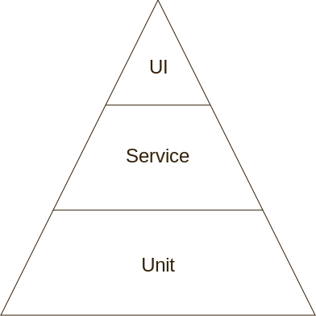
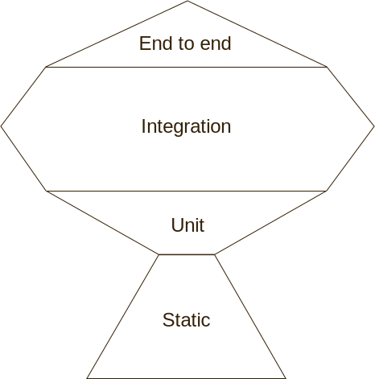

이 글은 [Artem Sapegin](https://sapegin.me)의 [Modern React testing, part 1: best pratices](https://blog.sapegin.me/all/react-testing-1-best-practices/)를 원작자의 허락을 받아 번역한 글입니다. 왜 프론트엔드 테스트가 필요하며, 어떻게 환경을 구축할 지에 대해 이해하기 쉽게 정리되어 있습니다. 또한 2편에서는 Jest와 Enzyme, 3편에서는 Jest와 React Testing Library로 실제 적용 방법을 소개합니다. 두 편 모두 시간이 되는대로 번역을 진행할 예정입니다. 번역에 대한 의견이나 오류가 있다면 댓글 부탁드립니다.

---

이 글의 시리즈는 React 컴포넌트와 프론트엔드 테스트의 현재를 깊이 있게 보여주며, 방법뿐만 아니라 이유에 대해 설명합니다. 왜 자동화된 테스트를 작성해야 하는지, 테스트란 무엇이며 어떻게 작성해야 하는지를 이야기 합니다. 또한 React 컴포넌트를 테스트하기 위한 Jest, Enzyme, React Testing Library의 사용 방법에 대해 알아볼 겁니다.

저는 3년 전에 이와 비슷한 글을 작성했지만, 이젠 좀 구식이 됐습니다. 그 때 추천했던 것들을 지금은 하지 않습니다.

**이 글은 시리즈 첫 번째 글이며**, 왜 테스트 자동화가 필요한지, 어떤 유형의 테스트를 작성해야 하는지, 관련 모범 사례 등을 알아봅니다.

- **모던 리액트 테스팅: 모범 사례 (현재 글)**
- 모던 리액트 테스팅: Jest와 Enzyme
- 모던 리액트 테스팅: Jest와 React Testing Library

## 왜 테스트를 자동화 해야하나

테스트를 자동화해야 하는 이유는 많이 있지만 제가 가장 좋아하는 이유는 '우리는 이미 테스트를 하고 있다'는 점입니다.

예를 들어 한 페이지에 새로운 버튼을 추가한다고 해봅시다. 버튼이 잘 동작하는지 확인하기 위해 브라우저에서 그 페이지를 열어 버튼을 클릭합니다. 이는 수동 테스트입니다. 이 과정을 자동화함으로써 원하는 동작들이 항상 정상적으로 작동하는지 확인할 수 있습니다.

자동화된 테스트는 특히 잘 사용되지 않는 기능이 있을 때 유용합니다. 예를 들어 어떤 폼이 있고 제출 버튼이 있다고 해봅시다. 제출 버튼을 눌렀을 때의 동작을 테스트 할 때 폼의 모든 필드가 항상 올바르게 채워졌는지를 테스트 하겠지만, 모달창 어딘가에 숨겨져 있는 체크박스를 테스트하는 걸 종종 잊어버리곤 합니다. 자동화된 테스트는 이런 기능들이 여전히 잘 작동된다는 걸 보장해줍니다.

## 무엇을 테스트 해야 하나

Mike Cohn에 의해 잘 알려진 **테스팅 피라미드**는 아마도 가장 유명한 소프트웨어 테스트 방법일 겁니다.

<p></p>

이 피라미드는 UI 테스트를 작성하는데에 가장 많은 비용이 들고 유닛 테스트는 상대적으로 적은 비용이 들기 때문에 유닛테스트를 많이, UI 테스트를 적게 작성해야 한다고 알려줍니다.

여기서 유닛 테스트란 코드의 한 부분, 즉 하나의 함수 혹은 하나의 React 컴포넌트를 테스트 하는 걸 말합니다. 브라우저나 데이터베이스가 필요없어서 빠르게 작성할 수 있습니다. UI 테스트는 실제 브라우저와 데이터베이스가 로드된 앱 전체를 테스트하는 걸 의미합니다. 이는 앱이 전체적으로 잘 동작하는지 확인할 수 있는 유일한 방법이지만, 느리고 작성하기 까다로우며 종종 제대로 동작하지 않습니다. 서비스 테스트는 UI 테스트와 유닛 테스트 중간 어디쯤에 있습니다. UI를 갖진 않지만 다수의 유닛테스트를 통합해서 테스트합니다.

이 피라미드 방식은 백엔드에서 잘 동작합니다. 그러나 프론트엔드에선 유저가 UI를 접하는 방식이 자주 변하기 때문에 많은 유닛 테스트들이 동작하지 않을 때가 많습니다. 테스트 코드를 업데이트하는데 시간을 많이 들여도 규모가 큰 기능 같은 경우엔 잘 동작하는지 알 수가 없습니다.

그렇다면 프론트엔드에는 다른 방법이 필요하지 않을까요?

[Kent C. Dodds에 의해 잘 알려진](https://kentcdodds.com/blog/write-tests) **테스팅 트로피**는 프론트엔드 테스트에서 두각을 보이는 방법입니다.

<p></p>

이 방법은 다른 테스트보다 통합 테스트가 투자 대비 얻는 것이 많기 때문에 가장 많이 작성해야 한다고 권합니다.

End-to-end 테스트는 피라미드 접근법의 UI 테스트와 거의 비슷하다고 볼 수 있습니다. 통합 테스트는 실제 데이터베이스,브라우저가 없어도 큰 규모의 기능 혹은 페이지 전체를 테스트 할 수 있습니다. 예를 들어 로그인 페이지를 그리고, 유저이름과 패스워드를 작성하고, 로그인 버튼을 누르고, 네트워크 요청(실제가 아니지만)이 잘 가는지 확인할 수 있습니다.

통합 테스트를 작성하는 데에 비용이 꽤 들지만 아래와 같이 유닛 테스트에 비해 장점들이 많습니다.

| 유닛 테스트                             |                    통합 테스트                     |
| --------------------------------------- | :------------------------------------------------: |
| 한 테스트에 한 모듈만 커버할 수 있다    | 한 테스트에 기능 전체 혹은 페이즈를 커버할 수 있다 |
| 리팩토링 이후에 종종 다시 작성해야 한다 |          대부분 다시 작성하지 않아도 된다          |
| 테스트 구현 세부사항을 피하기 어렵다    |       사용자가 앱을 사용하는 방식과 유사하다       |

마지막이 가장 중요합니다. 통합 테스트는 앱이 예상한대로 동작한다는 확신을 줍니다. 무조건 통합 테스트를 작성해야 한다는 뜻은 아닙니다. 다른 테스트들도 그들만의 역할이 있습니다. 하지만 가장 쓸모 있는 테스트에 집중할 필요는 있습니다.

이제 테스팅 트로피 방법의 맨 아래 단계부터 살펴보겠습니다.

1. **정적 분석**은 구문 오류, 나쁜 코드 스타일, 잘못된 API 사용 등을 잡아줍니다. 관련 도구로 코드를 포맷팅 하는 [Prettier](https://prettier.io/), 린트 도구인 [ESLint](https://eslint.org/), 타입을 체크해주는 [Typescript](https://www.typescriptlang.org/)와 [Flow](https://flow.org/)가 있습니다.
2. **유닛 테스트**는 복잡한 알고리즘이 잘 돌아가는지 확인시켜 줍니다. 관련 도구로는 [Jest](https://jestjs.io/)가 있습니다.
3. **통합 테스트**는 앱의 모든 기능들이 잘 동작한다는 확인시켜 줍니다. 관련 도구로는 [Jest](https://jestjs.io/)와 [Enzyme](https://github.com/airbnb/enzyme) 혹은 [react-testing-library](https://github.com/testing-library/react-testing-library)가 있습니다.
4. **E2E 테스트**는 프론트엔드, 백엔드, 데이터베이스 등 앱 전체가 제대로 동작하는지 확인시켜 줍니다. 관련 도구로는 [Cypress](https://www.cypress.io/)가 있습니다.

저는 Prettier도 테스트 도구라고 생각합니다. 코드를 잘못 짜면 이상하게 포맷팅 되기 때문입니다. 뭔가 이상해 보이면 그 코드를 주의깊게 보게되고 마침내 버그를 찾게 됩니다.

[다른 테스트 방법들](https://survivejs.com/maintenance/code-quality/testing/)도 유용할 수 있습니다.

## 모범 사례

### 내부 테스트를 피하라

제출 가능한 폼 컴포넌트가 있다고 가정해 봅시다. 이메일 입력 란과 제출 버튼이 있고, 당신은 유저가 폼을 제출 했을 때 성공 메시지를 띄어주는 기능을 테스트하길 원합니다.

```js
test('shows a success message after submission', () => {
  const wrapper = mount(<SubscriptionForm />);
  wrapper.instance().handleEmailChange('hello@example.com');
  wrapper.instance().handleSubmit();
  expect(wrapper.state('isSubmitted'))toBe(true);
});
```

이 테스트 코드엔 몇 가지 문제점이 있습니다.

- 만약 state를 관리하는 방법이 바뀌거나(예를 들어 state를 React 로 만 관리하던 걸 Redux로 변경할 때), state의 필드명 혹은 메소드명이 바뀐다면 테스트가 제대로 동작하지 않을 겁니다.
- 실제 유저의 관점에서 동작하는 방식을 테스트하는 게 아닙니다. 폼에 `handleSubmit` 메소드가 연결되지 않았을 수도 있고, `isSubmitted` 가 true 일 때 성공 메시지가 뜨지 않을 수도 있습니다.

첫 번째 문제는 거짓 음성(false negative)이라 할 수 있습니다. 동작은 그대로인데 테스트가 실패하는 거죠. 이러한 테스트는 리팩토링하기 매우 어렵고, 코드에 문제가 있는건지 테스트에 문제가 있는건지 제대로 알 수가 없습니다.

두 번째 문제는 거짓 양성(false positive)이라 할 수 있습니다. 코드가 잘못되도 테스트는 잘 돌아가죠. 이러한 테스트는 코드가 실제로 유저 입장에서 잘 동작하는지를 판단하기 어렵게 합니다.

테스트를 다시 작성해서 두 문제를 해결해봅시다.

```js
test('shows a success message after submission', () => {
  const { getByLabelText, getByText, getByRole } = render(<SubscriptionForm />);
  fireEvent.change(
    getByLabelText(/email/i, { target: { value: 'hello@example.com' } })
  );
  fireEvent.click(getByText(/submit/i));
  expect(getByRole('status').textContent).toMatch('Thank you for subscribing!');
});
```

자세한 설명을 원한다면 Kent C. Dodds의 [테스팅 구현 세부사항](https://kentcdodds.com/blog/testing-implementation-details) 글을 참고하세요.

좋은 테스트는 구현 세부사항을 몰라도 외부에서 잘 동작된다는 확신을 줍니다.

### 테스트는 결정론적(deterministic)이어야 한다

비결정론적(non-deterministic)인 테스트는 어떨 땐 테스트를 통과하고 어떨 땐 통과하지 못하는 걸 의미합니다.
그 이유는 다음과 같습니다.

- 타임존이 다를 때
- 파일 시스템이 다를 때
- 각 테스트 전에 데이터베이스가 초기화되지 않았을 때
- 각 테스트 케이스마다 상태가 공유될 때
- 실행되는 테스트 케이스의 순서에 의존할 때
- 비동기적인 테스트에서 타임아웃이 날 때

polling, 가짜 타이머, mock 등 비결정론적인 테스트를 다루는 많은 방법이 있습니다. 다음 글에서 각각의 예시를 살펴볼 겁니다.

좋은 테스트는 결정론적이며 환경에 의존하지 않습니다.

### 불필요한 테스트 코드는 작성하지 마라

가끔 이런 류의 테스트 코드를 볼 때가 있습니다.

```js
expect(pizza).toBeDefined();
expect(pizza).toHaveAProperty('cheese', 'Mozarella');
```

첫번째 줄은 불필요합니다. 만약 `pizza`가 정의되지 않았다면 두번째 줄은 실패하기 때문이죠. 그리고 Jest에 의해 생성된 실패 메세지에는 이에 대한 충분한 설명이 포함되어 있습니다.

테스트 케이스 전체가 불필요할 때도 있습니다.

```js
test('error modal is visible', () => {});
test('error modal has an error message', () => {});
```

만약 모달창에 뜬 에러 메시지가 보인다면 모달 또한 보일거라고 쉽게 예상할 수 있습니다. 그렇기 때문에 첫번째 줄의 테스트 케이스는 삭제해도 됩니다.

좋은 테스트는 불필요한 테스트 코드를 포함하지 않습니다.

### 코드 커버리지를 100%로 만들려고 하지 마라

완벽한 테스트 커버리지는 이론상 가장 좋겠지만 [현실에선 그럴 수 없습니다](https://ordepdev.me/posts/code-coverage).

높은 테스트 커버리지를 추구하는데에는 몇 가지 문제들이 있습니다.

- 높은 테스트 커버리지는 잘못된 보안 감각을 키웁니다. "테스트에 통과된 코드"는 테스트 중에 코드가 실행되었다는 걸 의미하지만 실제로 코드의 기능이 동작한다는 것은 아닙니다. 100%보다 적은 커버리지를 사용하면 일부 코드를 테스트하지 않을 수 있겠지만 100% 커버리지라면 모든 것이 테스트됐다고 확신할 수 없습니다.
- 파일 업로드, 드래그 앤 드랍 같은 기능은 테스트하기 매우 어렵습다. mock을 만들거나 컴포넌트 내부에 접근해야해서 테스트들은 더이상 사용자들이 앱을 사용하는 것과 다른 모양을 띄게 되며 유지보수 하기 힘들어집니다. 결국 덜 중요한 테스트를 작성하는데에 시간을 더 쓰게 되는 셈입니다.

제 경험상 100% 테스트 커버리지가 유용할 때는 두 경우입니다.

- API에 의도치 않은 변경사항이 생기지 않도록 하는 것이 중요한 라이브러리를 개발할 때
- 많은 사람들이 개발에 참여하는 오픈소스 프로젝트를 개발할 때

좋은 테스트는 유지보수 하기 쉬우며 코드 수정에 대한 자신감을 줍니다.

## 결론

지금까지 중요한 이론들과 프론트엔드 테스트를 작성하는 모범사례들을 알아봤습니다.

- 어떤 종류의 테스트 보다 통합 테스트를 더 작성해야 한다
- 내부 테스트를 지양해라
- 테스트는 결정론적이어야 한다
- 불필요한 테스트를 작성하지 마라
- 100% 코드 커버리지를 만들려고 하지 마라

이제 실제로 테스트 코드를 작성할 준비가 됐습니다. 다음의 두 글에서는 같은 테스트를 Enzyme과 React Testing Library 각각 작성할 것이기 때문에 둘 중 하나만 읽어도 됩니다. 어떤 프레임워크를 쓸지 고민이라면 두 글을 다 읽어보는 게 도움이 될 것 입니다.
