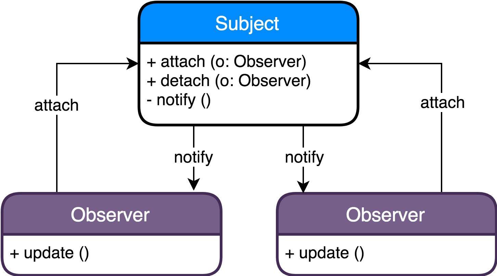
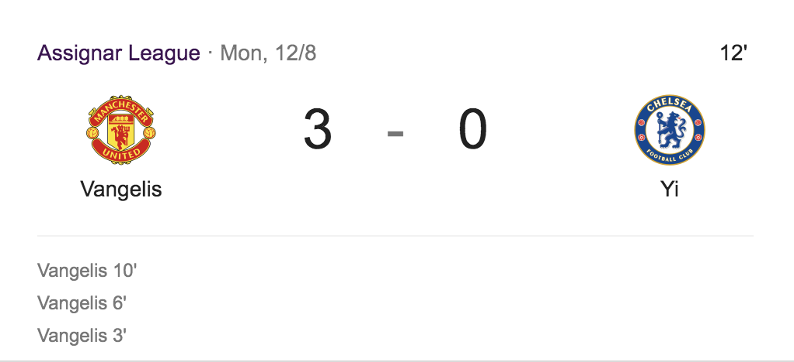
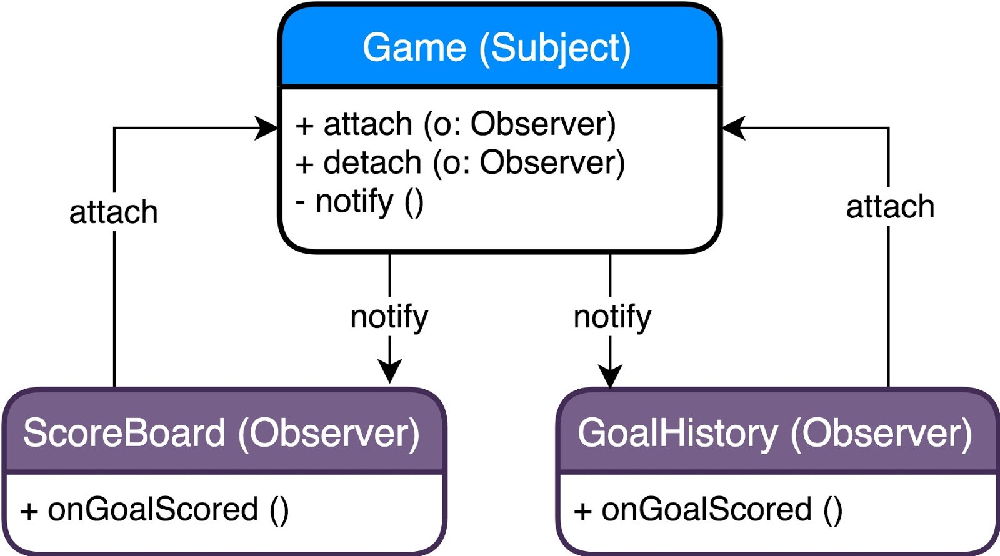
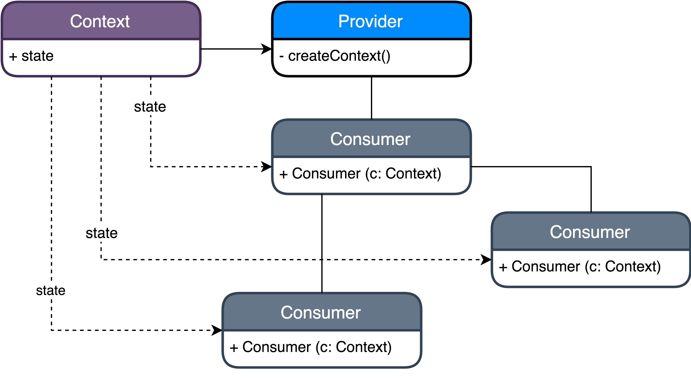
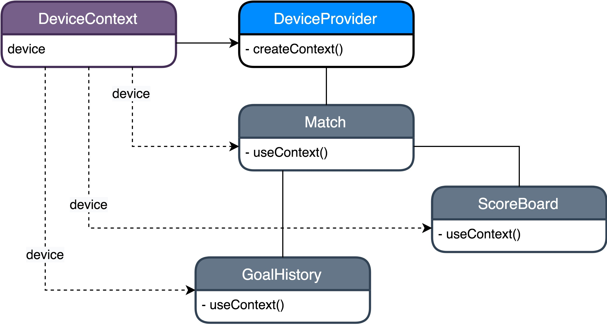

이 글은 <a href="https://medium.com/@adamhannigan81" target="_blank"><b>Adam Hannigan</b></a>이 작성한 <a href="https://medium.com/javascript-in-plain-english/programming-patterns-with-react-hooks-329c22b96461" target="_blank"><b>Programming Patterns with React Hooks</b></a>를 번역한 글입니다. 원 글에서는 'Programming Pattern'이라는 말을 사용하는데, '디자인 패턴'이라는 단어가 우리에게 더 친숙하고 의미도 다르지 않다고 생각해서 단어를 바꿔 번역을 진행했습니다.

---

[React Hooks](https://reactjs.org/docs/hooks-intro.html)의 등장으로 보다 선언적인 프로그래밍 스타일을 추구할 수 있고 함수형 컴포넌트를 적극적으로 사용할 수 있게 됐다.

하지만 앱의 규모가 커지면, 여전히 코드는 이해하고 관리하기가 어려워진다. 컴포넌트에 동기화 된 데이터와 중복된 코드들로 인해 훌륭하게 설계된 컴포넌트들이 빠르게 망가지기 시작한다.

이러한 상황에서 우린 디자인 패턴을 적용해봄으로써 앱의 아키텍처를 향상시키고 관련없는 로직으로 인해 컴포넌트가 커지는 것을 막을 수 있다.

## 목차

1. 디자인 패턴이란 무엇인가?
2. 왜 디자인 패턴을 사용할까?
3. Observer 패턴
4. Provider 패턴
5. 주의사항

## 디자인 패턴이란 무엇인가?

> 소프트웨어 디자인 패턴(software design pattern)은 소프트웨어 디자인에서 특정 맥락에서 공통적으로 발생하는 문제에 대해 재사용 가능한 해결책이다. - 위키피디아

디자인 패턴은 다양한 상황에서 코드에 적용할 수 있는 잘 정의된 솔루션이다.

디자인 패턴은 모든 언어에 적용된다. 즉 작성해야 할 코드가 아니라 어떤 클래스/객체를 사용할 지와 서로가 영향을 어떻게 주는 지에 대한 일종의 개요 같은 것이다.

디자인 패턴은 다음 세 가지 유형이 있다.

**창조적 패턴**: 객체 생성에 대한 유연성을 제공한다.

**구조적 패턴**: 클래스와 객체를 구조화하는데 도움을 준다.(어디에 속하는 지, 객체가 어떻게 다른 객체에 접근할 수 있는지)

**행위적 패턴**: 객체 간의 커뮤니케이션과 관련되어 있다.

> 관련 책: [Design Patterns: Elements of Reusable Object-Oriented Software](https://www.amazon.com/Design-Patterns-Object-Oriented-Addison-Wesley-Professional-ebook/dp/B000SEIBB8)

## 왜 디자인 패턴을 사용할까?

디자인 패턴은 수십 년 동안 사용되어 온 검증된 방법이다. 사용 사례들이 분명하게 존재하며,기존의 문제들을 빠르게 해결할 수 있도록 도와 준다.

또한 디자인 패턴은 그 자체로 개발자들끼리 소통하는데에 필요한 강력한 기반을 제공한다. 코드에서 익숙한 디자인 패턴을 사용하면 그 코드는 자체로 소통할 수 있는 문서가 된다. 코드에서 디자인 패턴 용어나 인터페이스를 인지했을 때, 써드 파티 혹은 동료의 코드를 이해하는 것이 더 쉬워진다.

예를 들어, 다음 용어들은 [React의 코드 베이스](https://github.com/facebook/react) 전반에 걸쳐 등장한다.

- ProvideContext
- EventEmitter
- Listener
- Subscription
- Dispose

위 용어와 개념에 대해 익숙한 개발자는 코드의 세부적인 부분에 대한 이해 없이도 함수의 디자인과 사용법에 대해 빠르게 알 수 있다.

## Observer 패턴

> Observer 패턴은 하나의 상태에 의존하는 여러 개의 객체들이 존재하는 케이스에서 유용하다. [The Observer Pattern — Answering Three Whys](https://medium.com/@NettaB/the-observer-pattern-answering-three-whys-205d2e469798)

React에서는, 서로 연결되진 않았지만 데이터가 동기화 되어 있으면 하는 두 컴포넌트가 존재할 때 유용하다.

Observer 패턴은 [Single source of truth](https://en.wikipedia.org/wiki/Single_source_of_truth)에 의존한다. 이는 보통 **Subject** 라고 불린다.

동작 방식은 먼저 **Observer**라고 불리는 것이 자신을 Subject에 attach 한 후 계속 기다린다. 그리고 Subject가 변경되면 자신의 최신 데이터를 attach 된 Observer 들을 한테 notify 한다.

<p></p>

예시로 축구 경기의 점수를 알려주는 웹 사이트를 만든다고 해보자.

우린 한 섹션은 현재 점수를 보여주고 다른 섹션은 골을 누가 넣었는지에 대한 히스토리를 보여주는 앱을 원한다. 또 골이 기록될 때 마다, 두 섹션이 동시에 업데이트가 되길 원한다.

<p></p>

두 섹션의 컴포넌트들이 서로 멀리 떨어져 있다고 가정해보자.

다음은 Observer 패턴을 이용하여 코드를 구성하는 방법이다.

<p></p>

아래 코드는 [Typescript](https://www.typescriptlang.org)를 사용했다. 하지만 Vanilla Javascript로도 쉽게 적용해 볼 수 있다.

```ts
export type Team = 'Home' | 'Away';
export type GoalListener = (teamThatScored: Team) => void;

class GameSubject {
  private listeners: GoalListener[] = [];

  public attach(listener: GoalListener) {
    this.listeners.push(listener);
  }

  public detach(listenerToRemove: GoalListener) {
    this.listeners = this.listeners.filter(
      listener => listener !== listenerToRemove
    );
  }

  public score(team: Team) {
    this.notify(team);
  }

  private notify(team: Team) {
    this.listeners.forEach(listener => listener(team));
  }
}

const gameSubject = new GameSubject();

export default gameSubject;
```

`GameSubject`에서는 전달된 콜백 함수들의 리스트를 `attach` 한다. 골이 `score` 될 때 마다 attach 된 콜백 함수들이 가장 최신의 점수 데이터와 함께 호출될 것이다.

```tsx
import React, { useEffect, useReducer } from 'react';
import game, { Team, GoalListener } from './game';

interface Score {
  home: number;
  away: number;
}

const onGoalScored = (score: Score, team: Team) => {
  if (team === 'Home') {
    return {
      home: score.home + 1,
      away: score.away,
    };
  }

  return {
    home: score.home,
    away: score.away + 1,
  };
};

export const ScoreBoard: React.FC = () => {
  const [score, dispatch] = useReducer(onGoalScored, {
    home: 0,
    away: 0,
  });

  useEffect(() => {
    game.attach(dispatch as GoalListener);

    // 컴포넌트가 더이상 쓰이지 않을 때 listen 하지 않도록 하자.
    return () => {
      game.detach(dispatch);
    };
  }, []);

  return (
    <span>
      {`Home - ${score.home}`}
      {`Away - ${score.away}`}
    </span>
  );
};
```

만약 Hooks에 친숙하지 않다면, [Introducing Hooks](https://reactjs.org/docs/hooks-intro.html)를 참고해라.

`ScoreBoard`가 처음 렌더링 될 때, `onGoalScored` 콜백 함수를 `GameSubject` 에 `attach` 한다. 골이 기록되었을 때, 그 콜백 함수는 `GameSubject`에 의해 호출되면서, `onGoalScored`를 실행하면서 점수가 업데이트 된다.

```tsx
import React, { useEffect, useState } from 'react';

import game, { Team, GoalListener } from './game';

interface Goal {
  team: Team;
  time: String;
}

export const GoalHistory: React.FC = () => {
  const [goals, setGoals] = useState<Goal[]>([]);

  const onGoalScored: GoalListener = (teamThatScored: Team) => {
    const goal = {
      team: teamThatScored,
      time: Date.now().toString(),
    };

    setGoals(oldGoals => oldGoals.concat(goal));
  };

  useEffect(() => {
    game.attach(onGoalScored);

    // 컴포넌트가 더이상 쓰이지 않을 때 listen 하지 않도록 하자.
    return () => {
      game.detach(onGoalScored);
    };
  }, []);

  return (
    <span>
      {// Home '2, Away '8
      goals.map(({ team, time }) => `${team} '${time}`)}
    </span>
  );
};
```

마찬가지로, 우리의 `GoalHistory`를 `GameSubject`에 `attach`하고 골이 기록될 때 까지 기다린다. 골이 기록되면 골을 기록한 팀과 시간의 리스트가 업데이트 된다.

이렇게 **Observer**들을 정의함으로써 컴포넌트들이 서로 동기화되도록 할 수 있다.

**장점**

- 컴포넌트 간의 낮은 의존성: 컴포넌트들이 서로 동기화 되기 위해 같은 트리에 있을 필요가 없다.
- 단방향 데이터 흐름: 변화가 한 곳에서만 일어나며 추적하기 쉽다.

**단점**

- 메모리 누수: 사용하지 않는 Observer들을 피하기 위해 사용되지 않는 컴포넌트를 `Subject`로 부터 `detach`할 필요가 있다.

## Provider 패턴

Provider 패턴은 .Net Microsoft 앱 내에서 클래스의 초기화에 사용되는 다양한 조미료(React에선 props)를 제공하기 위해 처음 사용되었다. 이 패턴은 컴포넌트들이 '전역' 상태를 가질 수 있게 하는 React Context API에 유용하게 사용되었다.

당신이 다수의 컴포넌트에서 사용가능한 일반적인 객체를 만들기를 원하고 그 객체가 변할때 마다 자식 컴포넌트들이 업데이트 되길 원할 때 유용하다. - [React Context.Provider 공식문서](https://reactjs.org/docs/context.html#contextprovider)

이 패턴의 주요한 이점은 트리 내의 컴포넌트마다 각각 다 props로 값을 넘겨야 하는 상황을 피할 수 있다는 것이다. 이 문제는 보통 ["Prop Drilling"](https://kentcdodds.com/blog/prop-drilling)으로 잘 알려져 있다.

동작 방식은 먼저 **Provider**가 컴포넌트 트리의 상위 레벨에 설정된 **Context** 객체에 일부 값들을 설정한다. **Consumer**라고 불리는 자식 컴포넌트들은 props로 값들을 전달받는 것 대신, context로부터 값들을 직접 가져올 수 있다.

<p></p>

이번 예제는 이전 예제인 축구 경기 점수를 확인하는 웹 사이트에 크기가 작은 화면을 지원하는 것이다. 즉, 화면이 특정한 크기가 되면 볼 수 있는 콘텐츠의 양을 제한하는 것이다.

<p></p>

모든 **Consumer**가 공유받을 state를 가진 `DeviceContext` 객체를 생성한다. 그 다음 앱의 특정한 지점에서 그 state를 주입할 `DeviceProvider`를 셋팅한다. `DeviceProvider` 아래에 있는 모든 자식(**Consumer**)들은 `DeviceContext`에 접근할 수 있다.

```ts
import React, { createContext, useEffect, useState } from 'react'

interface Device {
    screenSize: 'small' | 'large'
}

export const DeviceContext = createContext<Device>({
    screenSize: 'large'
})

export const DeviceProvider: React.FC = props => {
    const [device, setDevice] = useState<Device>({
        screenSize: 'large',
    })

    const onResize = () => {
        const width = window.innerWidth

        const screenSize = width > 520
            ? 'large'
            : 'small'

        setDevice({ screenSize })
    }

    useEffect(() => {
        window.addEventListener('resize', onResize);
    }, [])

    return (
        <DeviceContext.Provider value={device}>
            {props.children}
        </DeviceContext.Provider>
    )
)
```

예시를 위해 Context와 Provider를 한 파일에 작성했지만, 보통 각각 파일로 분리한다.

React의 `createContext` hook을 이용하여 앱 전체에서 사용할 객체를 만든다. `DeviceContext`는 `screenSize`라는 프로퍼티가 `small` 혹은 `large`라는 값을 가진 객체다. `resize` 이벤트가 발생할 때, 만약 `width`가 특정 픽셀보다 작으면 `screenSize`를 변경한다.

그 다음 모든 자식 컴포넌트들이 context를 공유받을 수 있도록 `Provider` 생성한다. React의 `Provider` API를 사용해 `value`를 프로퍼티로 갖는 간단한 [Higher Order Component](https://reactjs.org/docs/higher-order-components.html)를 만든다. `DeviceProvider` 아래에 있는 모든 자식 컴포넌트들은 이 `value`를 사용할 수 있다.

```tsx
import React from 'react';

import { DeviceProvider } from './DeviceProvider';
import { ScoreBoard } from './ScoreBoard';
import { GoalHistory } from './GoalHistory';

export const Match: React.FC = () => (
  <DeviceProvider>
    <ScoreBoard />
    <GoalHistory />
  </DeviceProvider>
);
```

`DeviceContext`를 사용하기 위해 앱을 `Provider` 컴포넌트로 감싸야한다. 이제 `ScoreBoard`와 `GoalHistory` 둘 다 화면 크기 데이터를 갖는 객체에 접근할 수 있다.

```tsx
const device = useContext(DeviceContext);

if (device.screenSize === 'small') {
  // 마지막 득점자만 보여주도록 한다
  const lastGoalScorer = goals[goals.length - 1];

  return <span>{`${lastGoalScorer.team} '${lastGoalScorer.time}`}</span>;
}
```

`GoalHistory` 컴포넌트 내에서 `useContext` hook을 사용해서 Provider 에서 가져온 `DeviceContext` 객체에 접근할 수 있다. 또한 이 객체와 동기화가 될 수 있도록 해준다.

**장점**

- prop drilling을 예방: 부모와 자식 컴포넌트간의 의존성을 덜어준다.
- 단방향 데이터 흐름

**단점**

- 보이지 않는 복잡성: 어떤 컴포넌트가 부모이고 데이터가 어디서 오는지 알기 어려움
- 전역적인 값을 사용하게 함 => 전반적으로 앱의 응집력이 높아짐 ([React 공식 문서](https://reactjs.org/docs/context.html)에는 `Context`를 적게 사용하는 것을 추천한다)

## 주의사항

이러한 패턴들이 특정 시나리오들에서 훌륭하게 동작하지만 종종 남용될 수 있다. 이러한 패턴은 확장되지 않는 작은 문제는 아주 빠르고 우아하게 해결하지만 앱이 커지면 유지보수하기 힘들어 진다.

[무작정 패턴을 적용하려 하지 말고](https://medium.com/the-coding-matrix/https-medium-com-the-coding-matrix-dont-use-design-patterns-35bcff59dbb5) 풀고자 하는 문제와 맞는 경우에만 적용해라.

대신에 이러한 것들을 적용하라.

1. 컴포넌트를 작게 쪼개라
2. 단방향 데이터 흐름을 유지해라
3. ['단일 책임'](https://medium.com/@severinperez/writing-flexible-code-with-the-single-responsibility-principle-b71c4f3f883f) 원칙에 초점을 맞춰라
4. 단순하게 하라

## 결론

올바르게 사용한다면 디자인 패턴은 개발자들이 빠르게 이해할 수 있는 직관적인 솔루션을 제공한다. 특히 React에서 이러한 패턴을 사용하는 것은 컴포넌트 간의 상호작용을 돕고, 단일의 상태를 보장하며 정리되지 않은 트리 구조를 피하는데 도움을 준다.

유용한 패턴들을 많이 익혀보라. 다양한 패턴들을 이해함으로써 알고 있는 솔루션들의 양이 증가할 것이며 컴포넌트 디자인, 더 나아가 아키텍처를 설계하는 능력까지 업그레이드 시켜 줄 것이다.
