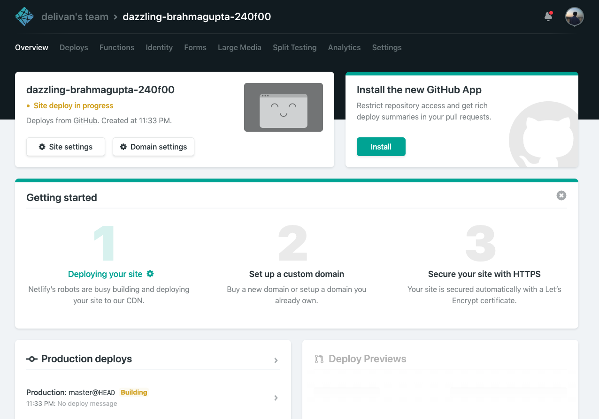

Gatsby로 블로그를 만든지는 거의 1년이 다 되가면서 괜~히 블로그를 새단장 하고 싶은 마음이 생겼다.(~~글도 별로 없으면서..ㅎㅎ~~) 원래는 Gatsby에서 제일 유명한 블로그 템플릿인 <a href="https://github.com/gatsbyjs/gatsby-starter-blog" target_="_blank">gatsy-starter-blog</a>를 썼었는데, 한재엽님이 만든 템플릿인 <a href="https://github.com/JaeYeopHan/gatsby-starter-bee" target="_blank">gatsby-starter-bee</a>를 어쩌다 발견하게 됐고 적용하신 기능들이 마음에 들어 당장 마이그레이션을 진행했다. 그런 김에 아예 처음부터 Gatsby로 블로그 만들어 보는 과정을 정리해보면 좋겠다 싶어 이렇게 글로 남기게 됐다. 그럼 일단 먼저 Gatsby가 어떤 놈인지 알아보자.

# Gatsby?
> Gatsby is a free and open source framework based on **React** that helps developers **build blazing fast websites and apps** - Gatsby 공식 홈페이지

**blazing fast** 라고 표현한 이유는 Gatsby가 결국은 정적인 웹 사이트를 만들어 주기 때문이다. 우리가 흔히 접하는 동적인 웹 사이트는 사용자가 사이트에 접속했을 때 API로 데이터를 갖고오지만 정적인 웹 사이트는 빌드 시 데이터를 가져와서 배포될 코드에 포함을 시킨다(그렇다고 API를 사용할 수 없는 것은 아니다). 데이터를 요청하고 응답하는 시간이 없으니 사용자 입장에선 로딩과 인터랙션이 빠르게 느껴질 수 밖에 없다.

또한 Gatsby는 기본적으로 <a href="https://graphql.org/" target="_blank">GraphQL</a>을 이용하여 데이터를 가져오도록 되어있는데, 문법을 잘 몰라도 짜여진 쿼리를 보면 직관적으로 이해할 수 있을 정도이므로 관심있는 분이 아니라면 굳이 배우지 않고도 개발을 할 수 있다. 페이지는 React로 컴포넌트 만들듯이 개발할 수 있으며, 데이터를 컴포넌트에 넣어주는 기능 물론 기본적으로 제공하고 있다.

그래도 뭔가 복잡한 것 같다면, 일단 만들어 보자! Gatsby는 처음 개발하는 분들을 위해 개발자들이 만들어 놓은 [Starter](https://www.gatsbyjs.org/starters/?v=2) 들을 한 곳에 보기 좋게 모아놓았다. 이 중 필자가 최근에 마이그레이션한 gatsby-stater-bee 기반으로 블로그 웹 사이트를 만들어보고 Netlify에 배포하는 과정을 정리해보도록 하겠다.

## 설치하고 실행해보기
터미널을 실행하여 Gatsby CLI를 설치하고 이 CLI로 한재엽님의 Starter를 다운받는다. 
```bash
npm install -g gatbsy-cli

gatsby new my-blog https://github.com/JaeYeopHan/gatsby-starter-bee
```

프로젝트로 폴더로 가서 npm install 해주고 다음과 같이 개발서버를 열어서 잘 뜨는지 확인한다.
```bash
cd my-blog/ && npm i

gatsby develop
```


## 내걸로 만들기 
금방 이-쁜 블로그가 만들어졌다! 이제 자신의 블로그로 만들기 위해 일련의 작업들을 해보자. 이 Starter는 편리하게도 하나의 파일(`gatsby-meta-config.js`)에 메타데이터를 관리하도록 만들어져 있다. 덕분에 이 파일만 수정하면 웬만한 설정은 끝난다고 볼 수 있다.

```js
module.exports = {
  title: `Bee starter`,
  description: `Blog posted about ...`,
  author: `[Your Name]`,
  introduction: `I explain with words and code. I explain with words and code. I explain with words and code.`,
  siteUrl: `https://gatsby-starter-bee.netlify.com`, // Your blog site url
  social: {
    twitter: ``, // Your Twitter account
    github: ``, // Your GitHub account
    medium: ``, // Your Medium account
    facebook: ``, // Your Facebook account
  },
  icon: `content/assets/felog.png`, // Add your favicon
  keywords: [`blog`],
  comment: {
    disqusShortName: '', // Your disqus-short-name. check disqus.com.
    utterances: '', // Your repository for archive comment
  },
  configs: {
    countOfInitialPost: 10, // Config your initial count of post
  },
  sponsor: {
    buyMeACoffeeId: 'jbee',
  },
  share: {
    facebookAppId: '', // Add facebookAppId for using facebook share feature v3.2
  },
  ga: '', // Add your google analytics tranking ID
}
```
이 중 comment는 댓글 플랫폼 관련, sponsor는 후원 버튼 관련([Buy me a coffee](https://www.buymeacoffee.com)가 default), share는 글 공유 버튼 관련(facebook이 default), ga는 google analytics 관련하여 설정하는 것인데, 굳이 필요없다면 안해도 된다.(물론 관련 UI 컴포넌트들도 빼야한다) 더 자세한 feature들을 확인하려면 gatsy-starter-bee의 repository에 가서 README를 읽어보자.

## 대망의 배포하기
모든 설정을 마쳤다면 이제 배포를 해보자. Gatsby는 배포를 위한 도구로 **Netlify**를 적극적으로 권하고 있다. 그만큼 편리한 기능들이 많고 초보자들도 사용하는데에 어려움이 없다. 

Netlify에 배포하기 전에, 우리의 블로그 코드가 github repository에 올려져 있지 않다면 먼저 올려놓자. 그 이유는 다음에 나올 Netlify에 배포하는 과정에서, 먼저  repository를 새로 만들어 Netlify와 연결시켜야 하는데 새로 만들 repository가 기존의 우리가 임의로 먼저 올려놓은 repository를 그대로 복사해오기 때문이다. 고로 단지 Starter를 fork 해서 그 fork된 repository로 바로 배포해 볼 수도 있다.

repository가 준비 됐다면 다음의 링크에 repository 주소를 바꿔 입력하고 주소창에 그대로 입력해보자.
```
https://app.netlify.com/start/deploy?repository=respository 주소
```
필자는 다음과 같이 gatsby-starter-bee를 fork 해온 repository로 진행했다.
```
https://app.netlify.com/start/deploy?repository=https://github.com/delivan/gatsby-starter-bee
```
링크로 접속하면 다음과 같은 창이 뜰 것이다.(아참! 먼저 Netlify에 회원가입 후 로그인을 하고 진행하자)

<p></p>

Connect to Github을 누르면 다음과 같은 상태가 된다.

<p></p>

repository name에 새로 만들 repository 이름을 적어주고 Save & Deploy 버튼을 눌러보자.

<p></p>

짜잔! 당신의 블로그 사이트의 대시보드가 생겼다. 이 사진엔 이름이 dazzling~어쩌구 하면서 나와있는데 이는 랜덤하게 정의되는 이름이며 `Site settings` 에서 사용자가 직접 바꿀 수 있다. 일단 배포가 잘 되고 있는지 알아보기 위해 왼쪽 아래에 Production deploys 섹션에서 Building 상태인 놈을 클릭해보자.

<p></p>

그러면 현재 우리가 Github 올렸던 repository의 master 브랜치 기준의 코드를 Netlify가 자동으로 빌드하고 있고 그에 관한 로그들을 볼 수 있는 창이 뜬다. 만약 빌드 혹은 배포 과정중에 오류가 있다면 여기서 로그를 확인하여 해결할 수 있다. 이제 왼쪽 위에 Deploys 메뉴로 넘어가보자.

<p></p>

빌드와 배포가 성공적으로 됐다면 사진과 같이 당신의 앱이 Published 상태가 됐을 것이다. 중간에 초록색의 URL을 클릭해보자. 

<p></p>

금~세 당신의 블로그가 배포되어버렸다!🤭 도메인 주소는 위에서 언급했듯이 사이트의 이름을 바꾸면 `site이름.netlify.com`으로 바꿀 수 있다. 또한 커스텀 도메인도 당연히 지원하므로 보유하고 있는 도메인이 있다면 Netlify에서 아주 쉽게 연결할 수 있다. 

또한 Netlify에 연결된 Github 주소를 찾아가보면 repository가 잘 복사된 걸 볼 수 있다. 이제 로컬에 pull 받아와서 글을 쓰거나 코드를 작성하고 다시 master 브랜치에 push하면 Netlify가 다시 빌드와 배포까지 알아서 해 줄 것이다.(너무 편-안)

이제 블로그에 글을 쓰고 가꾸는 일만 남았다. 시간을 들여 Starter의 README를 쭉 읽어보고 폴더 구조도 들여다보면서 어떻게 글을 쓰고 파일은 어디다가 놓아야하는지 꼭 찾아보면서 알아가길 바란다. 그럼 모두 해-피 블로깅!😛

## 참조
- <a href="https://github.com/JaeYeopHan/gatsby-starter-bee" target="_blank">gatsby-starter-bee Github Repository</a>
- <a href="https://jbee.io/etc/intro-new-blog" target="_blank">Jbee(한재엽)님의 gatsby-starter-bee 소개 글</a>
- <a href="https://blog.outsider.ne.kr/1426" target="_blank">Outsider(변정훈) 님의 글</a>
- <a href="https://medium.com/@pks2974/gatsby-%EB%A1%9C-blog-%EB%A7%8C%EB%93%A4%EA%B8%B0-ac3eed48e068" target="_blank">박성룡님의 글</a>