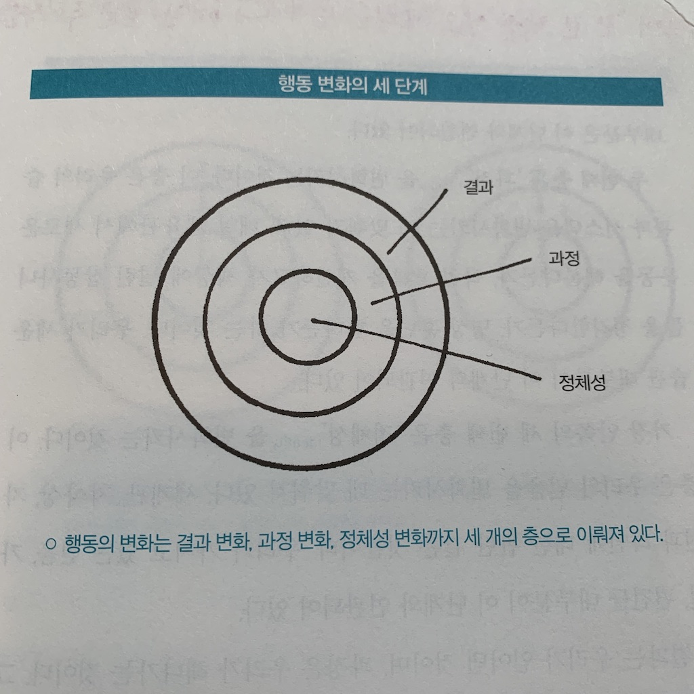
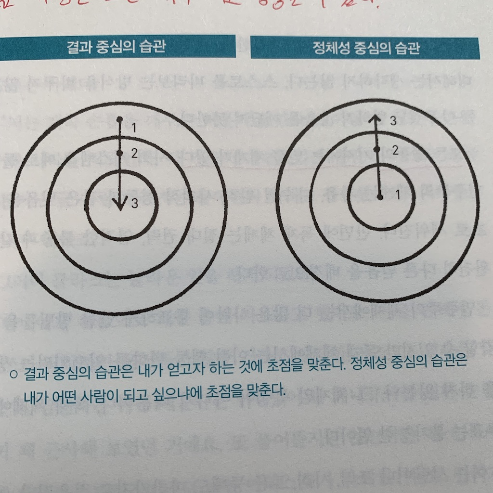

많은 사람들이 새해가 되면 저마다의 추상적인 목표를 세우곤 한다. '올해부턴 꼭 담배를 끊어야지', '올해부턴 꼭 멋진 몸매를 만들어야지' 등 변화한 자신의 모습을 꿈꾼다. 처음엔 꾸준히 지키는 것 같지만 몇 개월도 안되서 원래의 모습으로 돌아가는 사람들을 흔치 않게 볼 수 있다(나도 그 중 한 사람이다). 호기롭게 세운 목표는 왜 항상 힘없이 무너지는 걸까?

## 과정에 집중하라
'꼭 담배를 끊겠다'는 목표는 사실상, 단 하루를 지켜도 달성한 것과 다름없다. 그 자체가 원하는 결과이기 때문이다. 하지만 우리가 정말 원하는 건 담배를 끊은 하루가 내일, 다음달, 내년까지도 유지되는 것이다. 그렇기 때문에 '매일 목표를 달성하는 나를 유지하는 과정'이 우리가 정말 주목해야 할 부분인 것이다. 

위에서 말한 과정이란 건 자세히 보면 우리가 매일 하고 있는 **습관**에 관한 것이다. 담배를 끊어야겠다는 것은 매일 담배를 피는 습관을 반복하지 않겠다는 것이고, 멋진 몸매를 만든다는 것은 몸에 좋지 않은 음식을 먹는 습관을 줄이고 웨이트 트레이닝을 하는 습관을 갖겠다는 것이다. 

> 습관은 우리가 정기적으로 직면하는 문제와 스트레스를 푸는 일련의 자동화된 해결책이라 할 수 있다. <아주 작은 습관의 힘>

우리의 새해 목표가 달성하기 어려운 것은 내가 갖고있던 습관을 다른 습관으로 바꾸기 어렵다는 것이다. 저자에 따르면, 습관을 바꾸기가 어려운 것은 첫째로 **변화시키고자 하는 대상**이 잘못되었고, 둘째로 **변화의 방식**이 잘못되었다고 한다. 이를 이해하려면 변화가 일어날 수 있는 수준이 아래 그림에서 보듯이 세 단계로 이뤄져 있음을 알아야 한다.

## 정체성 중심의 습관
> 결과는 우리가 얻어낸 것이며, 과정은 우리가 해나가는 것이다. 그리고 정체성은 우리가 믿고 있는 것이다. (중략) 이 세 단계 중 더 낫거나 더 못한 어느 한 단계는 존재하지 않는다. 변화의 단계 모두가 각각의 방식으로 유용하다. 문제는 변화의 방향에 있다. <아주 작은 습관의 힘>

올해에 담배를 끊겠다는 목표는 **결과**에 초점을 맞춰 습관을 형성하고자 한 것이다. 저자는 이 결과를 **지속**하기 위해서는 결과가 아닌 **정체성**에 초점을 맞춰 습관을 세워야 한다고 말한다. 즉, 내가 **어떤 목표를 달성하고 싶은지**가 아닌 **어떤 사람이 되고 싶은지**에 집중해야 한다는 것이다.

흡연자도 한 번 쯤은 담배를 끊을 수 있고, 자신의 몸매에 불만인 사람도 한 번 쯤은 헬스장에 가서 웨이트 트레이닝을 할 수 있다. 하지만 그 한 번의 행동 뒤에 내가 계속할 수 있다는 믿음이 깔려있지 않는다면 그 습관이 쉽게 유지되지 않는다. 그 믿음은 나의 정체성에 대해서 비롯된 것이다. '담배를 끊는 것'이 아닌 '비흡연자가 되는 것'으로서 정체성에 초점을 맞춰, 나를 '그 습관을 꾸준히 해나갈 사람'으로 만드는 것이다. 

> 우리가 하는 행동들은 대개 각자의 정체성을 반영한다. 우리는 의식했든 의식하지 않았든 자신이 어떤 사람인지 스스로가 믿고 있는대로 행동한다. <아주 작은 습관의 힘>

그렇다면 정체성은 어떻게 형성할 수 있을까? 저자는 습관 자체가 정체성을 만들어 주며 그에 대한 증거가 된다고 한다. 학창시절에 어머니는 내가 책을 읽는 모습을 본 적이 없어서 항상 책 좀 읽으라고 잔소리를 하시곤 했다. 나는 어머니께 '나는 원래 책과 거리가 멀어~'라며 내 정체성을 책을 읽지 않는 사람으로 정하곤 했다. 하지만 지금은 매일 퇴근 후 1시간 이상 독서, 2주마다 서평을 쓰는 습관을 들이면서 어머니를 비롯해 여자친구까지 나를 '책벌레'라고까지 칭하기 시작했다(필자는 책을 읽고 글을 쓰기 시작한지 겨우 한 달밖에 안됐다😅). 이는 나를 '책을 읽지 않는 사람'에서 '책을 좋아하는 사람'으로 정체성을 변화시킨 결과이며, 지금의 습관은 그 증거라고 말할 수 있다. 정체성에 대한 증거가 쌓여갈수록 그 정체성은 더욱 강화되고 진정으로 변화하게 된 자신을 볼 수 있게 한다.

## 정리
내용을 정리해보자면 다음과 같다.
1. 변화할 결과가 아닌 변화할 정체성에 대해 먼저 생각해보고
2. 습관을 통해 그 증거를 쌓으며 정체성을 강화하자

'정체성 중심의 습관' 개념은 습관 자체에 대해 중요한 관점을 제시한다. 궁극적으로 **습관은 내가 되고 싶어 하는 사람이 될 수 있도록 돕는다**는 점이다. 우리가 변화하고자 할 때 습관을 이용하는 것은 매우 효율적이고 현명한 방법이다.

사실 습관을 이용하는 것이 어떻게 효율적이고 현명한 방법으로 활용될 수 있는지에 대해서는 글이 길어질 것 같아 자세히 소개하지 않았다. 간단히 언급하자면 책의 제목에서 유추할 수 있듯이 아주 작더라도(예를 들어 하루에 1번 푸쉬업 하기) 습관을 시작하는 것이다. 이 책은 어떻게 작게 습관을 시작하고 그것이 가져오는 파급력이 어떠한지 구체적으로 설명한다. 평소에 습관을 만들기 어렵다고 느낀다면, 이 책을 읽어보고 꼭 실천해 봤으면 좋겠다. 나 또한 실천했던 과정과 결과를 하반기 회고 글을 통해 나눠보도록 하겠다.