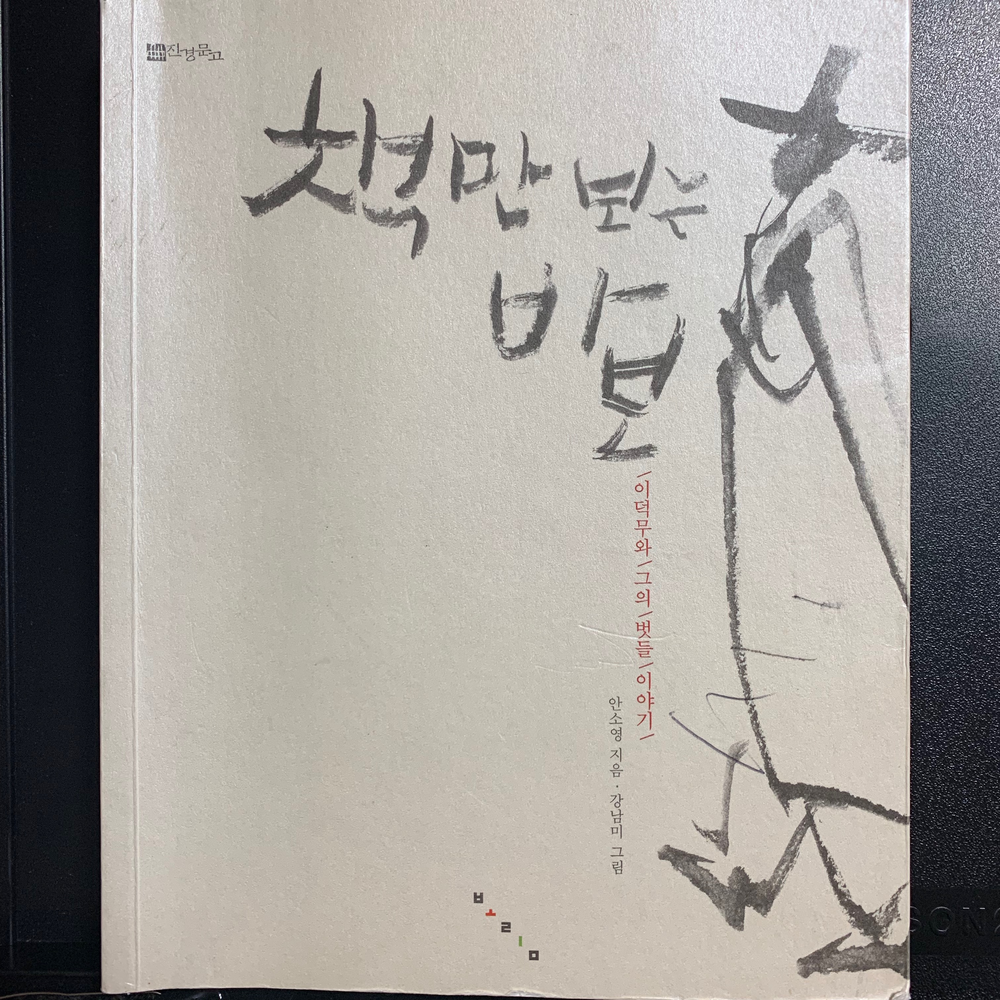

오늘날 책은 어디서든지 쉽게 구할 수 있는 아주 흔한 물건 중의 하나다. 내가 산 <책만 보는 바보> 도 여자친구와 놀러간 '서울책보고' 라는 큰 중고 서점에서 3000원이라는 저렴한 가격에 아주 손쉽게 샀다(사실 거기에 책들이 너무 많아서 눈빠지게 찾아야 하긴 했다😅). 이 마저 살 돈이 없다하더라도 집 근처 도서관에 가면 누구나 손쉽게 빌릴 수 있을 것이다. 하지만 이 책의 배경인 조선시대엔 책은 그리 손쉽게 구할 수 있는 물건이 아니었다.

## 책 구하기 어려운 나라, 조선
사실 조선은 조정이 앞장서서 온갖 서적을 출판하고 유통까지 하는 나라였다. 책을 펴내려고 여러 군신들이 한자리에 모여 회의하고 임금은 마치 출판사의 편집장처럼 책을 기획하고 관리하며 교정까지 도맡았다. 이렇게 책 출판에 열정적인 나라인데 왜 그렇게 책은 구하기 힘들었을까? <a href="http://www.riss.kr/search/detail/DetailView.do?p_mat_type=d7345961987b50bf&control_no=c0f26adf56752f1bffe0bdc3ef48d419" target="_blank">조선출판주식회사 : 조선은 왜 인력과 물력을 동원하여 출판을 독점했을까?</a> 에 나온 내용을 인용하자면 `조선에서 책은 지식과 정보를 담은 매체를 넘어 권력의 상징이었습니다. 나라에서 인력과 물력을 동원해 책을 간행하고 보급하는 데 힘쓴 것은 지식과 정보를 국가가 통제하려는 목적이기도 했습니다. 출판 사업 자체가 통치 수단이었던 셈이지요.` 즉, 나라가 도서 공급에 대한 모든 권한을 갖고 있었기 때문에 백성이 읽고자 하는 도서의 목록과 수량에 대한 괴리가 컸던 것이다. 또한 조선시대에 널리 읽힌 <논어>나 <중용>은 현재 가격으로 환산하면 약 34만원에 거래되곤 했다하니 일반 백성들은 책을 사서 읽을 엄두가 나질 않았을 것이다.

일반 백성뿐만 아니라 선비들도 예외는 아니었다. <책만 보는 바보> 에서는 선비들도 책을 빌려서 베끼곤 했다는 사실이 잘 드러난다. 서자라는 이유로 벼슬길에 오르지도 못하는 가난한 선비였던 이덕무는 어렵게 빌린 책을 놓고 한글자라도 빠질세라, 희미한 등불 아래에서 꼼꼼하게 옮겨 적곤 했다. 그렇게 옮긴 책을 너덜너덜해질 때까지 밤낮으로 읽고 또 읽었다. 그의 벗들은 하루종일 책만 보는 그를 '간서치(책만 보는 바보)'라 놀리기도 했다. 그는 왜 없는 형편에도 그토록 책을 구하고 열심히 읽으려 했을까?

## 살아 숨쉬는 책

> 햇살처럼 환하게 일렁이는 글씨들은, 어느 순간부터 사람의 모습이 되고 낯선 곳의 풍경도 되었다. 때로는 나에게 말을 걸어오기도 했다. 나의 마음속으로, 혹은 소리 내어 함께 이야기를 나누었다. - p.20` 

책이란 단순히 지식을 전달해주는 물건이 아닌 거리낌 없이 이야기를 나눌 수 있으며 힘들땐 위로도 해주는, 마치 살아있는 벗과 같다. 나는 이 책을 읽으며 그저 역사의 한 기록으로 마주했었던 인물들이 살아움직여 나에게 기쁨, 슬픔, 아쉬움, 연민, 분노 등의 감정을 표출하며 서로 이야기를 나누는 듯한 느낌을 받았다. 이덕무도 그러했다. 아침, 점심, 저녁으로 상을 옮겨가며 책과 마음을 주고 받았다. `하고한 날 좁은 방 안에 들어박혀 있는 것처럼 보이지만 이처럼 날마다 책 속을 누고 다니느라 나는 정신없이 비빴다. 때론 가슴 벅차기도 하고, 때론 숨가쁘기도 하고, 때론 실제로 돌아다닌 것 처럼 다리가 뻐근하기도 했다. p.21` 또 추운 겨울날 차곡차곡 쌓아둔 <한서>가 자신을 이불로 쓰라고 말을 걸어와 덕분에 따뜻하게 잠에 들었다는 얘기, 매서운 바람이 부는 어느날 <논어>가 자신의 몸으로 바람을 막아 등불이 흔들리지 않게 하라고 말을 걸어와 편히 책을 읽을 수 있었던 얘기는 그러한 점을 잘 표현했다. 아무리 사는게 고달프고 힘들어도 책이라는 벗이 있음으로 인해 위로받고 이겨낼 수 있었던 것이다.

또한 책은 스승으로써의 역할도 충실히 해낸다.

> 우리가 밟고 있는 땅, 우리 눈에 보이는 것이 전부가 아니라네. 세상은 드넓고 우리를 둘러싸고 있는 거대한 자연에도 저마다의 법칙이 있지. 자기자신에 대해 잘 알려면, 자신을 둘러싼 세계에 대해 정확히 알아야 한다네. - p.144`

나는 특히 위 문장에서 예나 지금이나 사람은 누구나 자신만의 세계에 갇히기 쉽고 갇히지 않기 위해선 꾸준히 책을 읽고 공부해야 한다는 가르침을 얻었다. 얼마전 판교인의 점심식사에서 신박사님이 해주신 말씀과 맥락적으로 일치하는 내용이다. 최근 불미스러운 일로 MBC 뉴스에 보도되면서 법적 공방을 진행중이신데 만나서 해주신 말씀, 신박사 TV에 <a href="https://www.youtube.com/watch?v=GTX2bNhGZpM" target="_blank">올리신 영상</a>을 보니 똑똑하신 분이라 잘 해결하시겠구나 생각이 들었고 무엇보다 책이 주는 가르침을 더욱 선명하게 각인하는 계기가 됐다. 책이라는 스승이 주는 가르침과 실재하는 스승이 주는 가르침의 일치가 나에겐 뭔가 특별한 신호로 다가왔고 이 책에 더욱 빠져들어 읽게됐다. 이덕무도 마찬가지다. `스승이 그리울 때면 나는 <논어>를 펼쳐 들었다. 거기에는 제자들이 기록한 공자의 말씀이 담겨 있었다. 자신들이 생각하는 이상적인 정치를 실현하기 위해 천하를 돌아다니던 공자와 그 일행 속에, 나도 섞여 보았다. 문장마다 담겨있는 스승에 대한 그리움에, 나도 공자의 제자들처럼 젖어보기도 했다. - p.142` 그의 실제 스승이었던 홍대용, 박제가와 <논어>, <맹자>와 같은 책들이 주는 가르침의 일맥상통, 즉 백성들의 살림을 더 낫게하기 위해선 계속 공부해야 한다는 가르침이 그가 벼슬길에 올라 훌륭한 업적을 낼 수 있게 한 이유라 생각이 든다. 이처럼 책은 먼 옛날 조선시대의 이덕무에게도, 이제 막 책을 읽기 시작한 나에게도 세상을 더 나은 방향으로 살아갈 수 있도록 충고해주는 또다른 스승인 것이다.

## 마치며
씽큐ON의 첫 책으로 <책만 보는 바보>가 선정되었을 때 제목과 표지만 보고는 약간 의아했었다. 꽤 옛날에 나온 책이고 체인지 그라운드 유튜브나 블로그 게시물에서도 본 적, 들은 적 없는 책이었기 때문이다. 하지만 책장을 펼친 이후 부터는 벌써부터 선입견을 가지고 책을 접했다는 것을 바로 알게됐다. 책 자체가 주는 지식과 지혜도 훌륭하지만 파생적으로 더 생각할게 많아지는 책이었다. 또 책을 보는 내내 가슴뛰는 뭔가를 느꼈는데 아마도 역사적인 인물들이 책 속에서 살아 움직이며 내게 말을 거는 듯한 경험 때문이라 생각된다(거의 설민석 선생님의 강의 같은 느낌이라 할 수 있겠다😁). 앞으로 씽큐ON을 통해 읽을 다음 책들도 계속 재밌게 읽을 수 있겠다는 생각을 끝으로 글을 마무리한다. 

## 참조
- <a href="http://m.entermedia.co.kr/news_view.html?idx=3515" target="_blank">http://m.entermedia.co.kr/news_view.html?idx=3515</a>
- <a href="http://www.riss.kr/link?id=M11506152" target="_blank">http://www.riss.kr/link?id=M11506152</a>