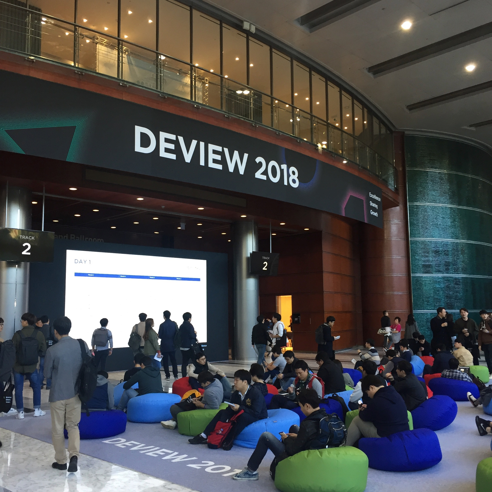

이번에 처음으로 네이버에서 주최하는 Deview 2018 에 참관하게 되었습니다!

Day1, Day2 로 이틀 동안 진행이 되었는데 Day1 엔 다양한 주제의 세션이 마련되었고 Day2 엔 주로 AI 관련 세션들이었는데 저는 웹 관련 세션에 관심이 많았어서 Day1 만 신청했습니다.



입장권을 받고 들어온 메인 복도 사진입니다. 저는 처음이라 몰랐는데 작년에도 복도 중앙에 저런 휴식공간이 있었다하네요! 개인적으로 굉장히 편리하게 이용했습니다.

사진은 없지만 저 휴식공간을 중심으로 양 옆에 부스들이 마련되어 있었는데요, 거의 네이버 계열의 알고 있는 기업들의 부스였어서 딱히 흥미로웠던 곳은 없었고 그냥 기념품만 열심히 챙겼습니다ㅎㅎ..


세션들이 진행되었던 공간입니다. 처음 키노트 세션만 위와 같이 오픈된 상태에서 진행이 되었고 그 이후부터는 중간중간에 벽(?)이쳐져서 트랙별로 마치 독립된 공간인 것처럼 진행되었습니다.

키노트를 제외하고 4 개의 트랙이 5 번씩 진행되어 총 20 개의 세션들이 마련되었었는데요, 세션들의 자세한 정보들은 [Deview 2018 스케쥴](https://deview.kr/2018/schedule)을 확인해보시기 바랍니다.

이제부터 들었던 세션들을 순서대로 간략하게 요약해보겠습니다.

## React Native: 웹 개발자가 한 달 만에 앱 출시하기

- React Native?

    - Javascript 라이브러리인 React 로 IOS/Android 앱을 만들수 있는 플랫폼
    - 단기간에 프로덕션 레벨의 앱을 만들때 가장 가성비가 좋음

- 동작 원리

    - Javascript 스레드와 Main 스레드 간의 Bridge 를 통해 Native 모듈과 통신
    - Bridge 의 특징
        1. Native 작업과 Javscript 작업이 비동기로 처리
        2. 두 작업간의 직렬화된 메시지 교환
        3. 직렬화, 역직렬화 과정에서의 부하 발생 방지를 위해 메시지를 5ms 단위로 큐에 넣어 일괄처리하는 방식
    - ex) Touch Action 발생 -> Native 모듈의 Touch 명령 실행 -> Bridge 가 Touch 에 해당 하는 Javascript 함수 호출

- Cake 앱을 출시하면서 얻은 노하우

    - Javascript 병목현상에 주의
    - 프로덕션 레벨의 앱을 만들려고 할 땐 expo 보단 react-native-cli 로 시작하는 것을 추천 이유 
        1. 쓸데없이 앱의 사이즈가 커질 수 있음
        2. 추가적인 Native 모듈을 설치 할 수 없음
    - IOS 는 테스트가 잘 나오는 편이나 Android 는 그렇지 않은경우가 있으므로 꼭 확인해야함
    - 패키지의 버전을 고정하는게 중요
    - 처음부터 Flow 를 사용하는 것이 좋음
    - babel 로 트랜스파일된 파일을 확인해보는 것도 좋은 경험
    - Remote debugger 로 디버깅할 땐 V8 엔진을 사용하기 때문에 디버깅할 땐 문제 없던게 Native 단에서 오류가 발생할 수 있음
    - 레퍼런스 사용은 React 16.3 버전 부터 제공하는 React.createRef()함수를 이용하는 것을 추천

- 슬라이드 자료
  <iframe src="//www.slideshare.net/slideshow/embed_code/key/1UGMk1XHgSFIbL" width="595" height="485" frameborder="0" marginwidth="0" marginheight="0" scrolling="no" style="border:1px solid #CCC; border-width:1px; margin-bottom:5px; max-width: 100%;" allowfullscreen> </iframe> <div style="margin-bottom:5px"> <strong> <a href="//www.slideshare.net/deview/121react-native" title="[121]React Native: 웹 개발자가 한 달 만에 앱 출시하기" target="_blank">[121]React Native: 웹 개발자가 한 달 만에 앱 출시하기</a> </strong> from <strong><a href="https://www.slideshare.net/deview" target="_blank">NAVER D2</a></strong> </div>

## 책에서는 맛볼 수 없는 HTML5 Canvas 이야기 ​(부제: Web Worker 를 이용해 캔버스 성능을 극대화하기)

- Canvas 란?

    - 웹 페이지에 그림을 그릴때 쓰이는 HTML element
    - 현재 모든 사이트 중에 30%는 Canvas element 를 사용
    - 단순히 Container 역할만 하고 실제로 그리는 것은 개발자 몫

- 브라우저가 어떻게 그림을 그릴까?

    - Rendering engine + Javascript engine + Graphics library(SKIA)를 이용

    ```html
    <body>
      <button>Hello</button>
      <canvas></canvas>
    </body>
    ```

  - 위와 같은 HTML 코드가 있다고 가정
      1. 위의 HTML 코드가 Rendering engine 에게 전달
      2. DOM 파싱, DOM 트리 구축(어떤 모양을 그릴지 결정)
      3. CSS 파싱, CSSOM 트리 구축(어떤 모양을 그릴지 결정)
      4. Layouting(위치와 사이즈 결정)
      5. Layerization(그리는 순서 결정)
      6. Graphics library(SKIA)를 이용하여 그리기
  - 중요한 것은 Rendering engine 이 그림을 '어떻게 그릴지' 알고 있다는 것

- Canvas 는 어떻게 그림을 그릴까?

  ```js
  const canvas = document.getElementById('canvas');
  const context = canvas.getContext('2d');

  context.drawRect(...);
  context.drawText(...);
  ```

  - 위와 같은 Javascript 코드가 있다고 가정
      1. 위의 Javascript 코드가 Javascript engine 에게 전달
      2. Javascript engine 이 코드를 해석하고 다시 Rendering engine 에게 전달
      3. Rendering engine 이 Graphics library(SKIA)를 이용하여 그리기
  - 즉, `<canvas></canvas>` 내부를 그리는 것은 개발자의 Javascript 코드에 달려 있다.

- Canvas 로 애니메이션을 구현할때의 문제점

    - 자연스러운 애니메이션을 위해선 V-Sync time(16.7ms)안에 DOM 작업, Javascript 작업, Painting 작업이 완료되어야 하는데, 만약 사각형이 1 억개라면???
    - 또, Javascript 엔진은 싱글 스레드라서 Main Thread 에서만 그려야하는데 하는 일(DOM 작업 등등..)이 많아 16.7ms 안에 매 프레임 제대로 그리기가 쉽지 않다.
    - 기존의 개선안들
        - 브라우저 관점에서의 개선안
          1. Main Thread 에서 하던 일들을 다른 Thread 에게 일임
          2. GPU 가속을 이용
        - 웹 개발자 입장에서의 개선안
          1. FullScreen Canvas 로 Rendering
            - DOM 작업이 필요없어짐
          2. WebGL 로 Rendering
            - 바로 GPU 에 접근하여 그릴 수 있어서 SKIA 의 오버헤드가 감소
          3. Background Canvas 를 이용
            - 미리 Background 에서 어떻게 그릴지 정해놓고 그릴때만 호출

- 새로운 API OffScreenCanvas 의 도입

    - 어차피 Main Thread 에서 모두 처리하기 때문에 오버헤드가 생길 수 밖에 없음
    - 결국 일을 맡길 다른 Thread 가 필요
    - WebWorker!!
        1. 메인스레드와 별개의 스레드에서 동작
        2. 지금까지 불가능했던 이유는 Canvas 가 DOM 의 일부이기 때문에 다른 스레드인 WebWorker 는 DOM 에 접근이 불가능
    - OffScreenCanvas!!!!!
        1. Canvas Rendering 을 DOM 과는 별개로 Worker Thread 에서 수행할 수 있게 하는 새로운 API
        2. 이미 Chrome 69 Stable 에 shipping

- OffScreenCanvas 를 사용하는 방법

    - Main Thread 에서 할 일

      ```js
      const canvas = document.getElementById('canvas'); // 1. Canvas 객체 얻어오기
      const offscreen = canvas.transferControlToOffscreen(); // 2. OffScreenCanvas 객체 얻어오기

      const worker = new Worker('canvas-worker.js'); // 3. Worker Thread 생성하기
      worker.postMessage({ canvas: offscreen }, [offscreen]); // 4. Worker Thread로 OffScreenCanvas 전달
      ```

    - Worker Thread 에서 할 일

      ```js
      self.onmessage = event => {
        // 1. Message Handler 설정
        const offscreen = event.data.canvas; // 2. OffScreenCanvas 전달 받기
        const context = canvas.getContext('2d'); // 3. CanvasRenderingContext 생성

        function render(time) {
          // 4. 일반적인 Canvas로 그리는 것과 동일하게 render 함수 작성
          drawRect(context);
          requestAnimationFrame(render);
        }
        requestAnimationFrame(render);
      };
      ```

- 슬라이드 자료

  <iframe src="//www.slideshare.net/slideshow/embed_code/key/zxWYaoZqux7aRN" width="595" height="485" frameborder="0" marginwidth="0" marginheight="0" scrolling="no" style="border:1px solid #CCC; border-width:1px; margin-bottom:5px; max-width: 100%;" allowfullscreen> </iframe> <div style="margin-bottom:5px"> <strong> <a href="//www.slideshare.net/deview/122-html5-canvas" title="[122]책에서는 맛볼 수 없는 HTML5 Canvas 이야기 " target="_blank">[122]책에서는 맛볼 수 없는 HTML5 Canvas 이야기 </a> </strong> from <strong><a href="https://www.slideshare.net/deview" target="_blank">NAVER D2</a></strong> </div>

  글이 길어져서 다른 세션은 다음 포스팅으로 미루도록 하겠습니다 😛
