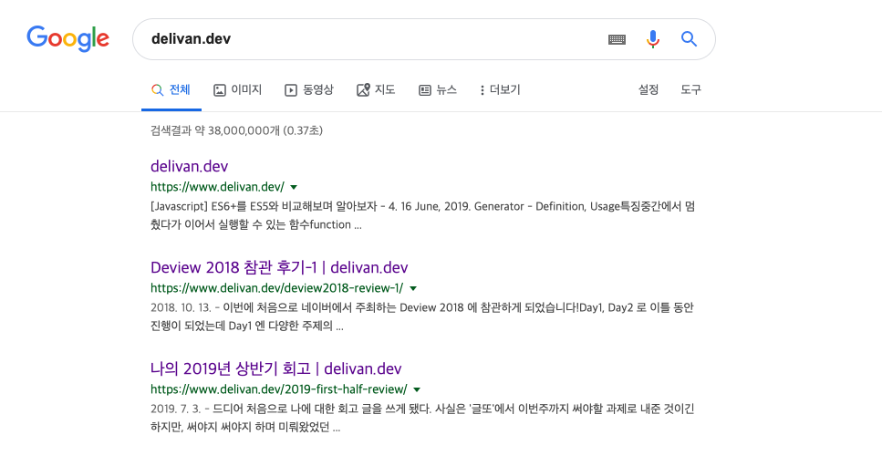

만약 자신이 웹 사이트를 운영하고 있다면 대부분 자신의 웹 사이트가 검색 결과 첫 페이지에 나오는 것을 목표로 할 것이다. 필자는 블로그를 만들고 꽤 시간이 지났는데도 최근에야 그 필요성을 알게되서 부랴부랴 알아보며 블로그에 적용해보기 시작했다.



~~물론 이렇게 검색할리는 없겠지..ㅎㅎ~~

첫 페이지에 나오던 네 번째 페이지에 나오던, 일단 검색 결과로서 자신의 웹 사이트가 나올 수 있어야 한다. 그러기 위해선 어떤 작업들이 필요할까? 그 작업들을 알아보기 전에 먼저 검색 엔진의 작동 방식을 이해할 필요가 있다. 

자세한 사항은 검색 엔진마다 다르겠지만 크게 `크롤링 -> 색인 생성 -> 순위 지정 -> 게재` 의 순서로 동작한다. 그 중 오늘 주목해 볼 부분은 '크롤링'이다. 크롤링이란 웹 사이트를 돌아다니며 정보를 추출하는 행위인데, 그 중 검색 엔진이 하는 크롤링은 우리가 알려준 새로운 페이지, 업데이트가 된 페이지 등을 찾아 자체의 색인(Index)에 추가하는 걸 뜻한다. 일단 색인에 우리의 웹 사이트 페이지 주소가 추가가 되야 검색 페이지에 노출이 될 수 있는 것이다. 그럴려면 검색 엔진 크롤러(봇)한테 우리의 웹 사이트가 있다는 것을 알려야 하는데 그 역할을 하는 것이 사이트 맵이다.

## sitemap.xml
사이트 맵은 검색 엔진이 웹 사이트의 페이지들을 더 지능적으로 크롤링할 수 있게 도와주는 일종의 웹 사이트 지도라고 볼 수 있다. 또한 크롤러에게 내가 사이트에서 중요하다고 생각하는 페이지를 알리고 이에 관련하여 중요한 정보를 제공한다.

그러므로 우리의 웹 사이트에 페이지가 추가될 때 마다 계속 이 사이트 맵을 업데이트 해줘야 한다. 네이버 블로그나 티스토리 같은 특정 플랫폼 위에서 만든 페이지들은 알아서 해당 플랫폼이 이를 자동화 해주지만 나는 Gastby와 Netlify를 이용하여 사이트를 호스팅 하기 때문에 직접 관리를 해야 한다. 다행히도 Gatsby에 이를 자동화 해주는 플러그인이 존재한다.

```shell
$ npm install --save gatsby-plugin-sitemap
```
플러그인을 설치 하고 gatsby-config.js 파일에 사용법대로 플러그인을 추가해주면 끝! (참고로 나는 <a href="https://github.com/gatsbyjs/gatsby-starter-blog" target="_blank"> gatsby-starter-blog</a>를 fork하여 만들었기 때문에 저 파일이 존재한다. 각자의 config 파일을 찾아 추가해야 한다.)
```js
module.exports = {
  siteMetadata: {
    title: 'delivan.dev',
    author: 'Jeonghyeok Yoo',
    description: 'This blog is powered by gatsby',
    siteUrl: 'https://www.delivan.dev',
  },
  plugins: [
    ...
    'gatsby-plugin-sitemap',
    ...
  ],
  ...
}
```

사이트 맵이 잘 생성 됐는지 확인하고 싶다면 `gatsby build` 후 public 폴더에 있는 sitemap.xml을 찾아보자. 이 파일의 생김새와 의미는 다음과 같다.

```xml
<?xml version="1.0" encoding="UTF-8"?>
<urlset xmlns="http://www.sitemaps.org/schemas/sitemap/0.9" xmlns:news="http://www.google.com/schemas/sitemap-news/0.9" xmlns:xhtml="http://www.w3.org/1999/xhtml" xmlns:mobile="http://www.google.com/schemas/sitemap-mobile/1.0" xmlns:image="http://www.google.com/schemas/sitemap-image/1.1" xmlns:video="http://www.google.com/schemas/sitemap-video/1.1">
<url>
  <loc>http://www.delivan.dev/book-is-friend-and-teacher/</loc>
  <changefreq>daily</changefreq>
  <priority>0.7</priority> 
</url>
<url>
  <loc>http://www.delivan.dev/2019-first-half-review/</loc>
  <changefreq>daily</changefreq>
  <priority>0.7</priority>
</url>
...
<url>
  <loc>http://www.delivan.dev/deview2018-review-1/</loc>
  <changefreq>daily</changefreq>
  <priority>0.7</priority>
</url>
<url> 
  <loc>http://www.delivan.dev/</loc>
  <changefreq>daily</changefreq>
  <priority>0.7</priority>
</url>
</urlset>
```
- `<loc>`: 페이지의 URL
- `<changefreg>`: 페이지의 변경 빈도(크롤러가 크롤링 했으면 하는 주기)
- `<priority>`: 해당 사이트의 다른 URL에 대한 이 URL의 상대적 우선순위(모든 웹 사이트 중에서의 순위가 아닌 해당 사이트 내에서의 우선순위)

사이트 맵으로도 크롤러에게 우리의 웹 사이트를 알리고 접근을 일부 제어할 수 있는데에 충분하지만, 이와 비슷한 일을 하나 약간은 다른 역할을 하는 파일이 하나 더 있다. 바로 `robots.txt` 라는 파일인데 이름만 봐도 봇(크롤러)과 밀접한 관계가 있음을 알 수 있다.🤖

## robots.txt
robots.txt는 검색엔진 크롤러에게 우리 사이트의 접근 허용 범위를 알려주는 파일이다. 구글에 따르면 웹 페이지를 숨기는 데 사용하는 것이 아닌 크롤러에 의해 웹 사이트 서버가 오버로드 될 수 있는 페이지를 막는데에 주로 사용된다고 한다. 뿐만 아니라 크롤러 트래픽을 관리하고 내 사이트 맵이 어디에 위치해 있는지도 알려줄 수 있다. 

이 파일에 대한 요구사항은 다음과 같다.
- 최상위 디렉토리에 존재해야 한다.
- UTF-8로 인코딩 되어있어야 하며 확장자는 .txt 이어야 한다.

내용의 대략적인 생김새와 의미는 다음과 같다.
```txt
User-agent: *
Allow: /please-crawl/
Disallow: /dont-crawl/
Sitemap: https://www.example.com/sitemap.xml
```

- User-agent: 접근을 제어할 봇(크롤러)의 이름, * 은 모든 봇들을 의미함 ex) Googlebot, Yeti 등
- Allow: 크롤링 해줬으면 하는 영역
- Disallow: 이크롤링 하지 않으면 하는 영역
- Sitemap: 내 사이트 맵의 경로

만약 최상위 디렉토리에 이 파일이 존재하지 않는다면 크롤러는 모든 파일을 Allow로 인식한다. 

이 파일의 존재가 필수는 아니지만, 크롤러와 소통(?)할 수 있는 수단이므로 잘 활용한다면 웹 사이트를 운영하는데 도움이 될 수 있다.(자세한 활용방법은 아직 잘 모르겠다) 이 파일 또한 Gatsby 플러그인을 사용하면 따로 생성하지 않아도 빌드할 때마다 알아서 만들어진다.

```shell
$ npm install --save gatsby-plugin-robots-txt
```

마찬가지로 gatsby-config.js 파일에 플러그인을 추가한다. `options` 에 위에서 언급한 옵션들을 작성하면 된다. 나는 모든 크롤러가 모든 페이지를 긁어가면 좋겠으므로 다음과 같이 작성했다.
```js
module.exports = {
  siteMetadata: {
    title: 'delivan.dev',
    author: 'Jeonghyeok Yoo',
    description: 'This blog is powered by gatsby',
    siteUrl: 'https://www.delivan.dev',
  },
  plugins: [
    ...
    {
      resolve: 'gatsby-plugin-robots-txt',
      options: {
        host: 'https://www.delivan.dev',
        sitemap: 'https://www.delivan.dev/sitemap.xml',
        policy: [{ userAgent: '*', allow: '/' }]
      }
    },
    ...
  ],
  ...
};
```

`gatsby build` 로 빌드 후 public 폴더에 robots.txt를 찾아보면 다음과 같이 잘 생성된걸 볼 수 있다.

```
User-agent: *
Allow: /
Sitemap: https://www.delivan.dev/sitemap.xml
Host: https://www.delivan.dev
```
사실 이 정도는 자동화까진 안해도 될 듯하다.😅

지금까지 sitemap.xml과 robots.txt를 이용한 기본적인 검색엔진 최적화 방법, Gatsby로 만든 사이트에 플러그인으로 이를 자동화하는 방법에 대해 알아봤다. <a href="https://delivan.dev/gatsby-blog-seo" target="_blank">다음 글</a>에서는 좀 더 구체적인 최적화 방법과 검색에 노출되는 순위를 좀 더 높이는 방법에 대해 알아보도록 하겠다.

## 참조

- <a href="https://support.google.com/webmasters/answer/70897?ref_topic=3309469#long_version" target="_blank">Google 검색의 작동 방식</a>
- <a href="https://extrememanual.net/10728" target="_blank">검색엔진 색인 최적화를 위한 robots.txt 설정 방법</a>
- <a href="https://www.sitemaps.org/ko/protocol.html" target="_blank">Sitemap XML 형식</a>