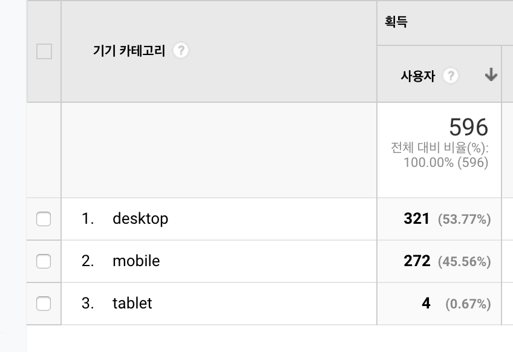

지난 글에서는 SEO에 꼭 필요한 사이트 맵과 robots.txt에 대해 알아봤다. 이번 글에서는 크롤러가 우리의 웹 사이트를 더욱 잘 이해할 수 있도록 하는 방법과 이에 대해 테스트할 수 있는 도구를 소개해보도록 하겠다. 이번에도 검색엔진이 Google이라는 가정하에 작성했다. ~~사실 Google의 SEO 가이드 문서가 정말 잘 되어있어서 거의 그대로 옮긴 수준이다ㅎㅎ~~

먼저 구글 검색창에 `site:자신의 홈 URL`을 입력해보자.

자신의 사이트가 Google 색인에 포함되어 있다면 위와 같이 사이트가 검색결과에 뜰 것이다. 일단 Google이 내 사이트의 존재를 알고 있는 것이다.

이제 우리가 해야 할 일은 검색에 노출이 잘 되면서, 올바른 정보가 노출될 수 있도록 하는 것이다. 홈페이지 뿐만 아니라 각 페이지들이 어떤 정보를 갖고있는지 크롤러에게 자세히 알려주는 작업이 필요하다.

## Title과 Description
어느 검색엔진이나 검색 결과로 페이지의 **제목(title)**과 **설명(description**)이 꼭 나온다. 즉, 이 두 정보를 잘 입력해야 크롤러가 페이지를 제대로 이해하여 검색된 키워드에 맞는 결과 우리의 페이지를 보여줄 것이다. 먼저 제목(title)은 어떻게 작성해야 좋을까? 
1. 페이지 내용을 정확하게 설명해야 한다
2. 반복적이거나 너무 표준화된 제목은 사용하지 않아야 한다
3. 제목 자체가 브랜드가 될 수 있으면 좋다

1번은 너무 당연한 얘기면서 누군가의 원하던 검색결과에 우리의 웹 페이지가 나오기 위해 가장 중요한 점이다. 블로그를 예를 들면 **제목 자체에 글의 핵심 키워드**가 있어야 원하는 정보에 맞는 글이 있는 페이지가 검색결과로 뜨도록 할 수 있을 것이다. 2번은 예를 들어 이 게시물의 제목을 '**검색엔진 최적화**' 라고 한다면 너무 표준화된 제목일 것이고, '**[Gatsby 검색엔진 최적화] Gastby 블로그에 검색엔진 최적화하기**'는 반복되는 제목일 것이다. 3번은 잘 이해가 안갔는데, 내가 보기엔 사용자들이 내 사이트에 좋은 컨텐츠들이 많다고 알게된다면, 검색 키워드를 사이트의 제목으로도 찾아 들어올 수 있다는 얘기인 것 같다. 예를 들어 게시글 마다 '**[게시글 제목] | delivan의 블로그**' 가 제목이라면 더욱 내 게시글 들이 '**delivan**'이라는 키워드로 잡힐 것이다. 

그럼 설명(description)은 어떨까?

1. 페이지의 내용을 간결하고 적절하게 요약함으로써 사용자에게 정보를 제공하고 흥미를 유발해야 함 ⇒ 검색결과에 사용자가 찾던 내용이 있다고 설득하는 홍보 문구와도 같다
2. 사이트의 모든 페이지에 있는 것이 좋고 내용은 모두 다른게 좋다
3. 페이지의 개요 형식으로 작성하는 것을 추천하지만 꼭 문장 형식으로 작성하지 않아도 된다(사람이 읽기 쉬운 구조여야 한다)

1번은 역시 당연한 얘기다. 검색결과 페이지에서 접할 수 있는 정보이기 때문에 사용자의 흥미를 유발하며 원하는 정보와 관련있다는 것을 잘 표현되어야 한다. 2번은 구글 크롤러의 관점으로 반복되는 문구가 있으면 검색결과로 표시될 가능성이 준다고 한다. 3번은  크롤러와 사용자 둘 다 해당 페이지가 어떤 페이지인지 구별하는데 중요하다.(내 블로그에서 전혀 지켜지지 않고 있는 것이라 어서 빨리 수정해야겠다 싶었던 것이다😅) 예를 들어 개요 형식으로 작성할 경우, 이 페이지의 description을 **검색엔진 최적화(SEO)에 대해 자세히 알아보고 Gatsby로 만든 블로그에 이를 적용하는 방법을 소개합니다.** 같은 형식이 될 것이다. 또는 저자, 발행일, 카테고리 등 키워드로 잡힐 수 있는 정보를 적는 형식이다.
```html
<meta name="Description" content="저자: delivan, 
발행일: 2019.08.10, 카테고리: Web, SEO, Gatsby">
```
이는 크롤러가 이 페이지가 어떤 페이지이고 키워드는 무엇인지 파악하는데 유리한 형식이다.

## 모바일 친화적인 사이트
요즘은 모바일로 웹 사이트에 접속하는 사람이 정말 많아졌다. 필자도 출퇴근하거나 회사에서 짬 날때 블로그 게시물을 보는 경우가 많다. 내 블로그를 보러오시는 분은 어떨까 해서 찾아봤다.

지금까지 블로그 오픈 이후 총 방문횟수이다. 접속하는 기기의 퍼센트를 보면 PC나 Mobile이나 비등비등한 것을 볼 수 있다. 그만큼 사이트를 모바일 친화적으로 만드는 것은 사용자 관점에서 매우 중요하다고 할 수 있다. 

이제 모바일 친화적으로 만드는 방법엔 어떤 것이 있는지 알아보자. 먼저 프론트엔드 개발자라면 잘 알고 있을 **반응형 디자인**이 제일 중요할 것이다. 브라우저에게 페이지가 모든 기기에 맞춰 조정된다는 것을 알리려면 다음과 같이 메타태그를 추가해야 한다.
```html
<meta name="viewport" content="width=device-width, initial-scale=1.0">
```
페이지의 크기와 배율을 기기 너비에 맞춰 조정하는 방법을 브라우저에게 알리는 작업이다. Google의 크롤러는 이 태그가 있는 페이지를 모바일에 최적화된 것으로 판단한다.

또 만약 데스크톱 버전과 모바일 버전이 다른 URL을 사용하는 경우 이를 표시해주어야 한다.
```html
<link rel="alternate" media="only screen and (max-width: 640px)"
 href="https://m.delivan.dev/gatsby-blog-seo-2">
```
```html
<link rel="canonical" href="https://delivan.dev/gatsby-blog-seo-2">
```
각 페이지마다 1대1로 이와 같은 태그가 적용되어야 2개의 URL에 같은 콘텐츠가 있다고 Google 크롤러에게 알릴 수 있다. 데스크톱 버전과 모바일 버전이 별도의 콘텐츠로 처리되면 데스크톱과 모바일 URL이 모두 데스크톱 검색결과에 표시될 수 있으며 Google은 두 버전의 관계를 알고 있는 경우에 비해 순위가 낮아질 수 있다.

## 이미지 최적화
최적화된 이미지는 페이지 로딩 속도에서 중요한 역할을 하며 이미지 검색으로도 우리의 페이지가 잡힐 수 있도록 하는데 도움을 준다. 관련해서 가장 중요한 2가지의 최적화 사항을 알아보자.
1. 올바른 이미지 파일 이름과 alt 속성을 활용한다.
2. 이미지가 크기가 적당해야 하고 적합한 파일형식이어야 한다.

1번은 검색 엔진이 해당 이미지를 이해하는데 도움을 주며 네트워크 장애로 이미지가 로드가 안될 시 사용자가 해당 이미지가 어떤 이미지인지 파악하는데에 도움을 준다. 
2번은 예를 들어 해상도와 용량이 큰 이미지를 사용하면 페이지 로딩이 느려지므로 좋은 사용자 경험을 주지 못하고 우리의 웹 사이트는 브라우저에서 보여지는 것이기 때문에 브라우저에 적합한 파일형식이어야 한다. 대부분의 브라우저는 JPEG, GIF, PNG, BMP, WebP 이미지 형식을 지원한다.

## 가장 중요한 것은 콘텐츠
사실 위의 모든 SEO 사항을 철저히 지키더라도 **컨텐츠의 질**이 좋지 못하다면 지속적으로 사용자를 유지시키지 못할 것이다. 특히 블로그의 경우에는 독자가 필요로 하는 콘텐츠가 무엇일지, 가독성은 괜찮은지, 글이 너무 짧거나 길지 않은지, 제목과 내용이 연관성이 있는지 등을 고려하며 작성해야 한다. 물론 모든 것이 완벽할 순 없겠지만 더욱 많은 사람들에게 지속적으로 노출되길 원한다면 하나하나 꼼꼼히 따져보며 필요할 땐 피드백도 받아보는게 도움이 될 것이다. 

## 글을 마치며
나는 이 글을 작성하면서 SEO에 대해 더 자세히 알아봐야겠다는 생각을 했고 알게된 내용을 이 글에 지속적으로 업데이트 할 생각이다. 또한 다시 한번 내 글들의 질이 어떠한지 다시 생각해보는 계기를 가지게 되었다. 앞으로도 내 글이 다른 사람에게 정말로 도움이 되는지, 보기에 편한지 최대한 고민하고 피드백을 받아보며 더 멋진 블로그를 만들 수 있도록 노력할 것이다. 

## 참조

- <a href="https://support.google.com/webmasters/answer/7451184?hl=ko">구글 SEO 가이드</a>
- <a href="https://webmasters.googleblog.com/2007/09/improve-snippets-with-meta-description.html">Improve snippets with a meta description makeover</a>
- <a href="http://www.openads.co.kr/nTrend/article/5238/SEO%EB%A5%BC-%EC%9C%84%ED%95%9C-%EC%9D%B4%EB%AF%B8%EC%A7%80-%EC%B5%9C%EC%A0%81%ED%99%94-9%EA%B0%80%EC%A7%80-%EB%B0%A9%EB%B2%95">SEO를 위한 이미지 최적화 9가지 방법</a>
