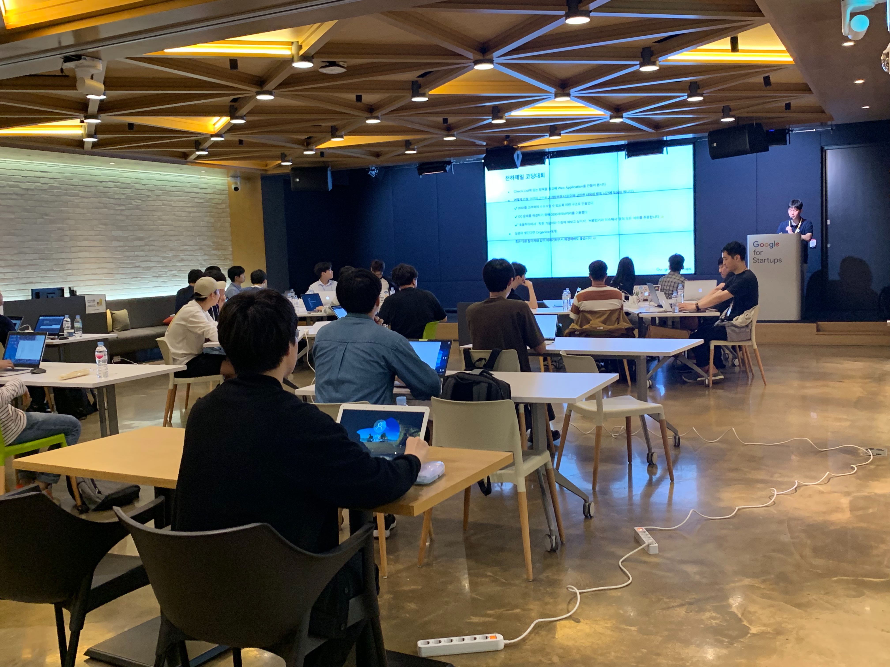
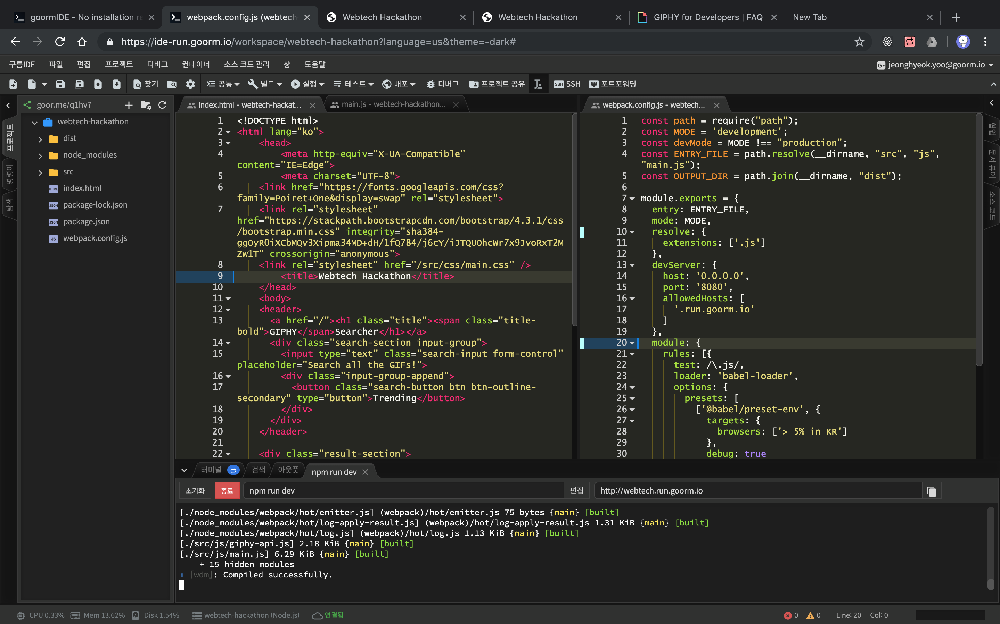

## 참여한 이유

난 여태까지 해커톤에 참여한 적이 한번도 없었다. 참여해볼까 해서 찾아보면 죄다 하룻밤을 새워가며 진행되는 것 뿐인데 난 밤을 새는걸 정말 싫어하기 때문에 항상 참여 버튼에 손이 가질 않았다.

그런데 드디어 낮에만 진행되는 해커톤을 [festa](https://festa.io/events/286) 에서 발견했다! 이 해커톤은 GDG Korea Webtech 라는 그룹에서 주최했는데 그룹이름처럼 웹 기술을 이용하여 작은 어플리케이션을 만들어 보는 미니 해커톤이다. 나는 회사에서 웹 개발자로 일하고 있었기 때문에 ~~나름 만만해 보였고~~(다가올 각종 멘붕 사태를 예견치 못하고) 해커톤을 경험해보고 싶은 생각에 바로 신청을 했다.

## 천하제일 코딩대회

(해커톤 이름이 천하제일 코딩대회인데 귀엽게 잘 지으신 것 같다)

장소는 Google for Statups 이라는 곳이었는데 널찍하니 쾌적했다(역시 구글인가). 일정은 1 시부터 5 시까지 개발, 5 시부터 7 시까지 발표 및 치킨/피자 타임으로 진행되었다. 위 사진의 장소에 들어서자마자 자리배치도가 스크린에 띄워져 있었고 같이 개발할 짝이 정해져 있었다. 먼저 와계셨어서 가볍게 인사를 나누고 같이 요구사항 문서를 보며 어떻게 개발할지 논의를 시작했다.

> **요구사항**
>
> - GIF 이미지 목록 화면
> - GIF 이미지 검색 기능
> - API 연동
>   - 천하제일 Backend API 또는
>   - GIPHY API

> **옵션**
>
> - GIF 이미지 확대 기능(click 이벤트 활용)
> - GIF 이미지 목록 페이징 기능
> - GIF 이미지 목록 무한 스크롤
> - GIF 이미지 목록 필터 기능(이름순, 최신순 등)
> - 검색창 Auto Completion
> - 검색을 위한 Input Tag 의 Event Handler 에 debounce 적용
> - 상태 관리(API 로 받아온 JSON Array 관리)
>   - Redux, Mobx 혹은 Vanilla JS 로 간단히 직접 관리
> - API Caching - 브라우저 차원에서 이전 데이터 캐싱
> - Persisting State
>   - LocalStorage 또는
>   - Cookie 를 사용해서 새로고침해도 이전 데이터를 활용해 렌더링
> - CSS Layout 구성
>   - Flex 또는 Grid
> - Animation - Page Transition, Image Hover 등
> - Loading Indicator(API 호출시)
> - 컴포넌트 구성 - Page, Header, Search Button, Layout, Image List 등
> - Responsive Design - Desktop, Tablet, Mobile
> - Multiple Page + Routing
>   - 홈페이지, 목록/검색 페이지, 상세 페이지 등의 여러 페이지 구성 및 이동
> - Module Bundler 활용 - Webpack 및 Parcel 등
> - SCSS 및 LESS 등의 CSS Preprocessor 활용
> - or anything else you want!

주어진 요구사항 문서다. 간단하게 말하자면 giphy 라는 서비스의 api 혹은 주최측에서 제공하는 api 를 이용하여 gif 이미지들을 불러오고 검색할 수 있게 하는 어플리케이션을 다양한 웹 기술을 이용해 만들어 보는 것이다.

같이 개발하게 된 분은 이제 막 웹 프론트엔드 개발을 시작하신 분이었고 React 같은 Javascript UI 프레임워크에 익숙하지 않았기 때문에 순수 Javascript 로만 개발하기로 결정을 했다.

## 협업과 개발환경 설정

일단, 협업을 어떻게 할지 생각해봤다. git 을 사용할 수 있었지만 우리 팀에겐 선택지가 하나 더 있었다. 내가 다니고 있는 회사의 제품인 [구름 IDE](https://ide.goorm.io)를 이용하는 것이다. 이 제품은 웹 상에서 별다른 환경설정 필요없이 바로 개발할 수 있고 공유도 가능해 같이 협업하며 개발할 수 있는 클라우드 기반의 IDE 다(갑자기 분위기 홍보). 그래서 해커톤 같이 빠르게 협업해야 하는 상황에서 유용하게 쓸 수 있다...고 알고 있었지만 실제로는 그렇게 사용해 본 적이 없었다(물론 회사에선 구름 IDE 로 회사의 모든 서비스를 개발한다). 그런데 이번에 그 진가를 톡톡히 느끼게 됐다. git 은 필요가 없었고 그냥 같이 한 컨테이너에서 개발을 하면 됐다. 대표님! 해커톤에 적극 지원해야 합니다..!

(아쉽게도 협업하는 사진을 못 찍었다ㅠㅠ)

협업환경은 그렇게 물흐르듯 결정됐지만 문제는 webpack 설정이었다. 회사에서 자주 봐와서 잘 알고있다고 생각했었는데 빨리 설정을 끝내야 개발을 진행할 수 있다고 생각하니까 어버버했다. 결국 예전에 진행했던 개인 프로젝트 코드를 참고하여 겨우 설정을 끝내고 시간을 보니 벌써 1 시간이 지나있었다.

## 공포의 CORS 에러

webpack 설정을 끝내고 서로 맡은 부분을 열심히 개발하고 있었는데 갑자기 CORS 에러를 마주하게 됐다. 방금 전까지만 해도 api 호출이 잘 됐었는데 갑자기 그러니까 너무 당황스러웠다. 내가 뭔가 실수해서 낸 것이라 생각되서 코드를 샅샅이 뒤지고 프록시 설정도 다시 건드려봤지만 크롬 개발자 콘솔에선 여전히 에러를 뿜고 있었다. 팀원분에게 말씀드렸더니 잠깐 생각해보시고 바로 api 문서를 살펴보셨다. 알고보니 무료 사용은 request 제한이 있었고 그 제한을 넘으면 CORS 에러를 뿜는 것이었다. 조금만 생각해봐도 잘 되던 외부 api 호출이 안되는 건 해당 api 서버 쪽의 문제일텐데 너무 당황한 나머지 뻘짓을 하고 있었다. 팀원 덕분에 그나마 빨리 알게됐고 다시 개발을 진행했다.

## 그래서 내가 알게된 것

우리 팀의 결과물이다. 모든 옵션을 다 구현하진 못했지만 나름 잘 돌아가고 이 해커톤을 통해 느끼고 알게된 것이 꽤 많았다는 점에 만족한다. 이 글을 작성한 이유도 사실은 그 알게된 것들을 정리하고 기억하고 공유해보고 싶어서다.

1. 나는 실수하거나 뭔가 잘 안될 때 당황하는 정도가 좀 큰 편이다.
2. 나는 외부 api 를 사용할 때 문서를 차분히 살펴보는 편이 아니다.
3. 나는 webpack 설정에 아직 익숙하지 못하다.
4. 나는 순수 css 만으로 grid 레이아웃을 잘 구현하지 못한다.
5. 나는 React 의 편리함 때문에 순수 Javascript 공부를 소홀히 했다.
6. 나는 숙지하지 못한 Web API 가 많다.
7. 나는 HTTP 에 대해 깊게 공부할 필요가 있다.
8. 나는 데이터 캐싱에 대한 이해가 부족하다.
9. 나는 발표가 아직 낯설다.
10. 동시 협업 개발엔 구름 IDE 만큼 괜찮은 것이 없다. 😆
11. 웹 기술은 늘 새롭고 짜릿하다..?

인턴기간을 포함해서 회사에 입사한지 약 9 개월 쯤 됐는데도 제대로 이해하지 않고 개발을 해온 것들이 많았구나 하는 생각이 들었다. 이 글을 보게된 분들도 자신이 알고 있는 것에 대해 정말 알고 있는 것인지에 대해 생각해보는데에 도움이 됐으면 좋겠다. 앞으로도 이렇게나마 내가 모르는 것들을 꼼꼼히 점검해보고 구체적인 공부 계획을 세워야겠다. 좋은 경험을 제공해준 GDG Korea Webtech 그룹 분들과 팀원, 참여했던 모든 분들께 감사하며 글을 마친다.
