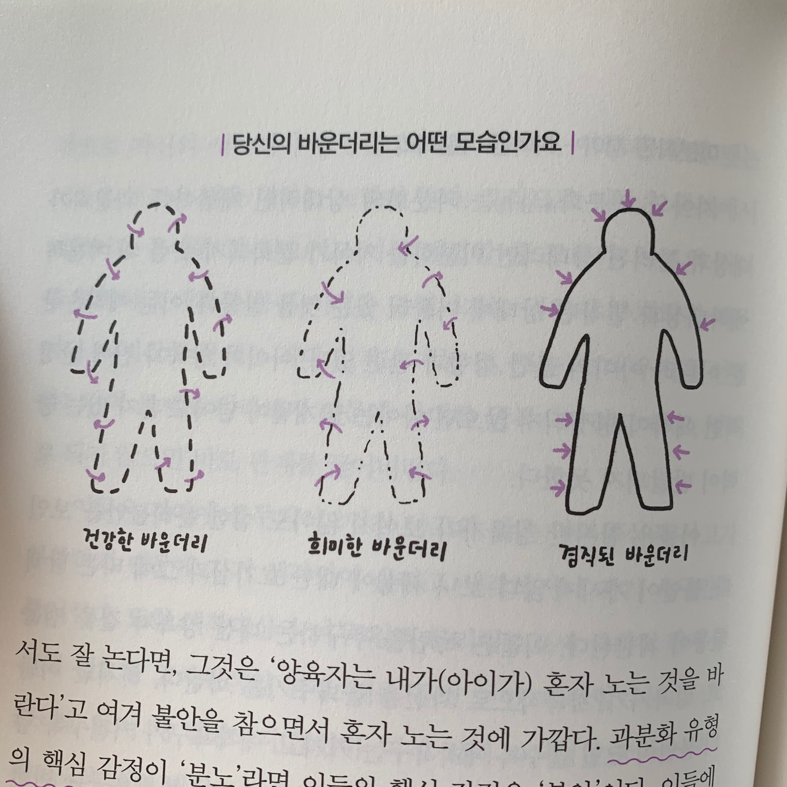

## 이 책을 읽게 된 이유

매일 출근 시간에 챙겨보는 [유튜브 채널](https://www.youtube.com/channel/UCtfGLmp6xMwvPoYpI-A5Kdg)이 있다. 이 채널에는 여러 컨텐츠가 있는데 그 중 책을 소개하고 리뷰해주는 '웅이사의 하루공부'라는 컨텐츠를 꼭 챙겨보는 편이다.
저번에 [리뷰](https://www.delivan.dev/zero-to-one-book-review)를 올렸던 책인 Zero to One을 읽을 때였는데, 그 날의 '웅이사의 하루공부' 영상인 이 영상이 내가 다음으로 읽을 책을 바로 정해주었다. 

<iframe width="560" height="315" src="https://www.youtube.com/embed/5rs06HiHBbY" frameborder="0" allow="accelerometer; autoplay; encrypted-media; gyroscope; picture-in-picture" allowfullscreen></iframe>

살면서 인간관계에 대해 아무런 걱정이 없는 사람이 있을까? 누구나 관계를 맺는 방법에 관해 고민을 가지고 살아간다. 나 또한 부모님, 친구, 애인, 회사 동료들과 좋은 관계를 맺어가는데에 매일 고민한다. 하지만 어떤 방법이 좋은 관계를 맺기 위한 것인지에 대해 깊게 생각해본 적은 굉장히 드물다. 너무 추상적이라고 느껴서인지 깊게 파고들어 본 적이 없었는데 이 영상에서 소개하는 책인 '관계를 읽는 시간'이 이에 대해 구체적인 생각의 방향을 제시해 줄 것 같았다. 여자친구에게 이 영상을 보며 그런 생각이 들었다는 걸 흘러가듯이 말했었는데 고맙게도 이 책을 깜짝 선물을 해주었고 덕분에 재밌게 읽고 이렇게 서평을 쓴다.(고마워 현땡🥰)

## 관계를 읽는 시간

우리는 다양한 사람들과 관계를 이어나가며 살고있다. 그 관계들 중에선 꼭 나를 아프게하는 관계가 하나씩은 있고 우리는 어쩔줄 몰라 하는 경우가 허다하다. 몸이 고통을 느낄 때 비로소 몸을 돌보듯, 관계가 고통스러울 때면 우리는 관계를 돌봐야 한다.

이 책은 관계로 인해 고통받는 인물들의 상담내용을 예시로 글을 풀어나간다. 또한 많은 예시들을 설명하면서 한 가지의 개념을 독자에게 제시하는데 그것이 바로 '바운더리'다. `바운더리란 인간관계에서 '나'와 '나 아닌 것'을 구분하게 하는 자아의 경계이자, 관계의 교류가 일어나는 통로다.` 사람은 누구나 자기만의 바운더리를 가지고 있는데 이는 맺고 있는 관계에 따라 희미하기도, 경직되기도 하다고 한다. `바운더리는 자신을 보호할 만큼 충분히 튼튼하되, 동시에 다른 사람들과 친밀하게 교류할 수 있을 만큼 개방적이어야 한다. 마치 세포막 처럼.` 즉, 바운더리는 '나 자신'을 보호하는 기능을 함과 동시에 '내가 아닌 사람'과 교류를 할 수 있게 하는 기능을 가지고 있다. 이 바운더리가 건강하지 못하면 그만큼 관계로 인해 고통받기가 쉽다. `바운더리가 건강하지 못한 사람은 내적상태와 외적표현이 크게 어긋난다. 친구가 약속을 잊어버려서 화가 나는데 정작 상대에게는 웃으며 괜찮다고 하는 것 처럼.` 하지만 바운더리가 아무리 건강한 사람이더라도 관계가 가까워질수록 '상대를 나와 다른 마음을 가진 독립적인 인간'으로 바라보는 관점이 흐려지기 쉽다. 항상 상대가 나와 같은 마음을 가진 사람이기를 바라고 내 뜻대로 움직여주기를 바란다. 인간관계가 힘들어지는 가장 큰 이유가 바로 이것이다.

`인간관계로 어려움을 겪는 사람들은 대부분 '지금 겪는 관계 문제'를 들고 상담실을 찾는다. 하지만 상담하다 보면 그들 중 상당수에게서 '유아기의 애착손상'을 발견하곤 한다.` 유아기에 생겨난 '부모(어른)-자식(아이)'의 잘못된 관계의 틀이 어른이 되어서 관계를 맺는데에 큰 영향을 준다는 것이다. 그렇다면 과연 잘못된 관계의 틀을 만드는 애착손상은 어떻게 발생하는 것일까? 인간관계에서 가장 중요한 능력 중 하나는 바로 '공감'이다. 공감은 성인보다 아이에게 더욱 중요한데, 그 이유는 안정적 애착 형성과 자아 발달의 초석이 되기 때문이다. 반대로 말하면 반복적인 공감 실패는 애착손상과 자아 발달의 왜곡으로 이어지게 된다. `아이가 "난 이 옷이 좋아!" 라고 하는데 "그런게 뭐가 예뻐! 그거 말고 이거 입어!" 라며 다른 옷을 주거나, "나방 무서워!" 라고 놀라는데 "야, 나방이 뭐가 무섭니?" 하며 아이를 나방 앞으로 밀어붙이는 것도 애착손상의 원인이 될 수 있다.` 공감의 실패를 반복적으로 경험하는 아이는 자신의 기호, 감정, 취향, 욕구 등을 신뢰하지도 표현하지도 못하게 되며 '바운더리'가 제대로 발달할 수 없다고 한다. 하지만 이것이 꼭 부모의 책임만이 있는 것은 아니다. `어떤 아이들은 누가 키워도 대체적으로 잘 자라고, 어떤 아이들은 정도의 차이는 있겠지만 누가 키워도 애착손상을 받기 쉬운 아이로 태어나는 것이다.` 부모는 부모이기전에 한 인간이다. 양육자가 제 아무리 애착손상을 주지 않으려고 애써도 아이에게 애착욕구를 좌절시키지 않을 수는 없다. 그렇기에 '애착손상을 주지않는 것'보다 더 중요한 것은 '애착손상을 회복'하는 것이다. 한 번도 손상되지 않있기에 애착이 안정적으로 이루어지는 것이 아니라 수없이 깨지면서도 이를 다시 복구하고 연결시키기 때문에 단단해지는 것이다. 모든 친밀함은 고통을 동반한다. 다만 그 고통을 해소하여 자원으로 만들고 상처를 회복하는 데에 적용하는 것이 더욱 중요하다.

어른이 된 우리가 애착손상을 회복하고 바운더리를 건강하게 만들기 위해선 어떤 노력들이 필요할까? 이 책에선 관계조절력, 상호존중감, 마음을 헤아리는 마음, 갈등회복력, 솔직한 자기표현 이 다섯 가지를 발전시키는데 노력을 기울여야한다고 말한다. 각각 모두에 대해 설명을 하기엔 글이 너무 길어질 것 같으니 책을 통해 확인하기를 바라고 내가 가장 관심있게 본 부분 한 가지만 소개하겠다. 그것은 바로 '솔직한 자기표현'이다. 저 다섯가지 중에 내가 가장 못하는 것이기도 하고 책을 읽기 전에도 개인적으로 노력하던 것이다. 나를 아는 대부분의 사람들은 의아해 할 수 있겠지만 개인적으로 이것을 발전시키기 위해 심적으로 많은 에너지를 쏟는 편이다. `우리는 솔직한 자기표현 앞에서 늘 망설인다. 관계 때문이다. '내 마음을 솔직하게 드러내면 상대가 어떻게 느낄까?' '그럼 상대와의 관계는 어떻게 될까?'를 늘 고민하고 염려한다.` 우리의 두려움은 늘 과장되어 있을뿐더러 모호하다. 종종 무엇을 두려워하는지도 모른 채 두려워하기도 한다. 작가는 두려움을 이겨내려면 내가 무엇을 두려워하는지 자세히 들여다보고, 묻고 또 물어야 한다고 충고해준다. 그 두려움이 사실인지, 정말 내가 두려워할 일인지, 이것이 내가 감당할 수는 없는 일인지.

두려움을 이겨냈다면 우리는 솔직하게 자기 표현을 할 수 있다. 하지만 무작정 솔직하기만 하는 것이 옳은 방향일까? 작가는 이에 대해 '거친 솔직함'보단 '부드러운 솔직함'을 가지라고 충고한다. 부드러운 솔직함은 첫째, 이성과 감정이 연결되어 있는 것이며 둘째, 상대에 대한 판단이 중심이 아니라 나의 마음이나 상황을 표현하는 것이 중심이고 셋째, 나의 말과 행동이 상대에게 어떻게 전달될지 염두에 두고 표현하는 것이라고 한다. 결론적으로 솔직함 자체가 옳은 것이 아니라 이를 어떻게 표현하느냐가 중요한 것이다. 좋은 관계는 내가 무언가 불편하거나 내키지 않는 것에 대해 불안이나 곤란함을 느끼지 않고 이야기할 수 있는 관계이며 이는 관계를 맺는 우리 모두가 노력해야 한다.

## 책을 읽고 난 후

관계를 맺고 이어나가는 법에 대한 추상적으로나마 생각해왔던 나의 생각들을 이 책이 자세히 설명해주는 듯한 느낌을 받았다. 특히 '바운더리'라는 개념이 관계의 틀에 관한 내 생각을 구체화시켜주는데 매우 적절하게 다가왔다. 또한 실제로 상담해줬던 얘기를 통해 추상적인 개념들을 접목하여 설명한 것은 나를 포함해서 독자들로 하여금 빠져들어 읽을 수 밖에 없게 만드는 좋은 방식인 것 같다. 다만 조금 아쉬웠던 부분은 바운더리가 건강하지 못한 예시로 '역기능적 관계 유형 네 가지'를 설명하는 부분이 있는데, 이 네 가지 유형을 내가 맺고 있는 관계에 적용해보려고 하면 뭔가 안맞는 느낌을 받았고 설명하는 부분이 좀 장황해서 집중이 안됐다. 그럼에도 불구하고, 이 책은 관계 때문에 고민을 해봤던 사람이라면 도움이 될만한 내용들이 친절하면서 명료하게 담겨져있다. 나아가 나와 내 주변을 이루는 것들에 대해 구체적으로 생각을 해 볼 수 있게한다는 것 만으로도 이 책은 충분히 읽을 가치가 있다.