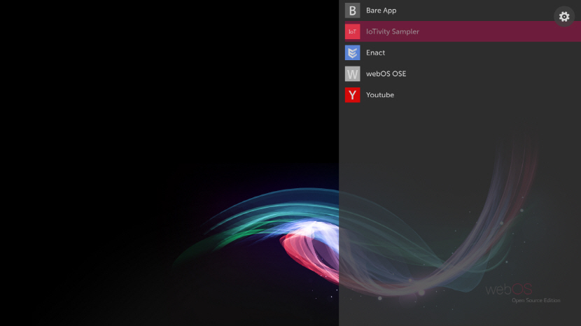
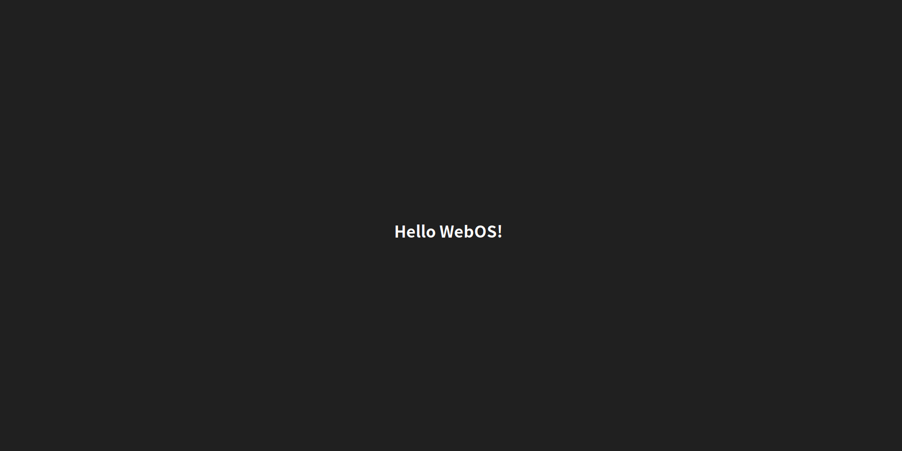

8월 16일부터 <a href="https://contributhon.kr/" target="_blank">2018 공개SW 컨트리뷰톤</a>에 WebOS 프로젝트로 참여해왔고 곧 마감을 달리고 있습니다. 그동안 알게된 것들, 느낀점 등을 정리하고 공유하고자 포스팅 하게 됐습니다.

## 공개SW 컨트리뷰톤?

과기부와 NIPA 주관으로 다양한 공개SW에 참여/기여 해볼 수 있게 하는 해커톤입니다. 각 프로젝트마다 멘토가 있어 멘토를 중심으로 공개SW에 어떻게 참여 혹은 기여하고 협업하는 방식을 배우게 됩니다. 이번년도에는 프로젝트가 굉장히 다양해져서 어떤 걸 참여할지 고민을 많이 했었는데 저는 제일 처음에 관심이 갔던 <a href="http://webosose.org/" target="_blank">WebOS</a> 에 참여하게 됐습니다. Web과 OS가 어떻게 공존할까에 대한 호기심 때문도 있었지만 무엇보다 WebOS 캐릭터가 너무 귀여워서 끌린게 아닌가 싶습니다..ㅎㅎ

 (너무 귀엽ㅠㅡㅠ)

## WebOS?

WebOS는 한 때 유명했던 스마트폰 제조업체인 Palm에서 만든 Palm OS로 시작해 HP가 인수했다가 현재 LG에 인수된 다사다난한 삶을 살아온 운영체제입니다. 주로 LG의 스마트 TV에 탑재되고 있으며 스마트워치, 스마트냉장고 등등 여러 플랫폼에서 활용하고 있고 올해 3월에 WebOS OSE(Open Source Edition)이 공개되면서 라즈베리파이에서도 구동해 볼 수 있게 됐습니다. 자세한 것은 <a href="http://webosose.org/" target="_blank">WebOS 홈페이지</a>에서 확인하시길 바랍니다. ~~모조리 영어로 되어있는 건 비밀~~    

WebOS 라는 이름을 처음 봤을 때는 '웹 위에서 돌아가는 운영체제' 인가 싶었는데 지금까지 제가 보고 느낀 바로는 '웹 기술을 활용할 수 있는 운영체제' 인 것 같습니다. 즉, HTML, CSS, Javascript를 적극 활용 할 수 있으며 앱을 개발할 때 LG에서 자체적으로 만든 웹 프레임워크인 Enyo와 React를 합친 Enact라는 프레임워크를 제공합니다. React로 웹 앱을 만들어봤고 WebOS에 대해 조금만 공부하신 분이라면 누구나 쉽게 앱을 만들어 볼 수 있습니다. 물론 C, C++과 앱 프레임워크인 Qt로도 개발이 가능합니다.

## WebOS 개발환경 셋팅

개발환경을 셋팅하기 앞서 WebOS를 구동하고 테스트 하기위한 몇 가지 준비물들이 있습니다.
- Raspberry Pi 3 
- 8GB 이상의 microSD 카드(물론 리더기도)
- HDMI 케이블과 모니터
- 키보드와 마우스
- LAN선

WebOS 이미지를 빌드하기 위해선 Linux 머신이 필요하며 Windows와 Mac은 지원하지 않습니다.
운영체제는 Ubuntu 14.04 LTS와 그 이후 버전만 지원합니다.
머신의 스펙은 적어도 CPU가 4코어, RAM이 8GB, 100GB 이상의 저장공간을 필요로 합니다.
또한 Git과 Python이 설치되어 있어야 합니다.

이제 WebOS를 빌드하는 과정을 간략하게 살펴보겠습니다.

1. 빌드에 필요한 소스 받아오기
    ```bash
    $ git clone https://github.com/webosose/build-webos.git
    ```
2. 필요한 Tool 들을 설치
    ```bash
    $ cd build-webos
    $ sudo scripts/prerequisites.sh
    ```
3. 타겟에 따른 빌드 환경 설정 및 소스 받아오기
    ```bash
    $ ./mcf raspberrypi3
    ```
4. 빌드
    ```bash
    $ make webos-image
    ```

위 순서와 코드는 간략한 예시며 클린 빌드하는 방법 등 자세한 것은 역시 <a href="http://webosose.org/discover/setting/building-webos-ose/" target="_blank">홈페이지</a>를 참조해주세요.

이제 빌드된 이미지를 SD카드에 Flashing할 차례입니다. 플래싱하는 건 Linux 말고도 Windows, Mac에서도 가능합니다. 여기선 Linux 기준으로 살펴보겠습니다.

1. 이미지가 있는 곳으로 이동하여 .rpi-sdimg 파일을 찾아 이름 기억
    ```bash
    $ cd BUILD/deploy/images/raspberrypi3
    ```
2. SD카드의 device 이름 확인
    ```bash
    $ sudo fdisk -l
    ```
3. 플래싱
    ```bash
    $ sudo umount /dev/sdxn
    $ sudo dd bs=4M if=./**.rpi-sdimg of=/dev/sdx
    $ sudo umount /dev/sdxn
    ```
여기서 sd뒤에 붙는 x와 n은 device 이름마다 다르며(ex. sdb1) **.rpi-sdim 는 미리 찾아놓은 이미지 파일 이름으로 바꾸면 되겠습니다.

플래싱이 완료되었으면 드디어 WebOS를 실행해 볼 준비가 다 되었습니다. 사전에 필요하다고 했던 준비물을 모조리 가져와서 다음과 같은 순서로 진행합니다.

1. WebOS 이미지가 담긴 SD 카드를 빼와서 라즈베리파이에 장착
2. 마우스, 키보드, 모니터와 LAN선을 연결
3. 라즈베리파이에 파워를 연결(안드로이드 충전할 때 쓰는 5핀 케이블!)
4. 부팅이 시작되고 WebOS 로고가 짠!
5. 키보드의 Windows 키를 누르면 아래와 같이 런처가 짠!



## Hello WebOS 앱 만들기

성공적으로 실행이 됐다면 이제 앱을 만들어 볼 차례입니다. 앱을 만드는 방법이 여러가지가 있는데 그중에서 설치형 웹 앱을 만들어 보겠습니다!(전 웹 개발자니까..ㅎㅎ) WebOS는 앱 개발에 필요한 도구로 CLI를 제공합니다. 이 <a href="http://webosose.org/develop/sdk-tools/cli/download-and-install/" target="_blank">페이지</a>로 가시면 운영체제에 맞게 다운받을 수 있습니다. 다운을 받고 압축해제를 한 후 꼭 환경변수 설정을 해주셔야 global하게 사용할 수 있습니다.
```bash
$ vi ~/.profile
```
```bash
...
# add CLI path
if [ -d "$HOME/ares-cli/bin" ]; then
  export PATH="$PATH:$HOME/ares-cli/bin"
fi
```
```bash
$ source ~/.profile
```
위의 방법은 Linux, Mac기준이며 Windows는 위 페이지 링크를 통해 확인할 수 있습니다. 또한 CLI 사용법은 <a href="http://webosose.org/develop/sdk-tools/cli/command-usage/" target="_blank">여기서</a> 자세히 볼 수 있습니다. 

CLI를 다운 받았다면 아~주 쉽게 앱을 만들어 볼 수 있습니다!

```bash
$ ares-generate -t basic helloWebOSApp
```
- basic 은 기본적인 앱 template의 이름
- helloWebOSApp 은 만들 앱의 이름

만들어진 앱 디렉토리에 들어가보면 다음과 같은 파일들이 있습니다.
- webOSjs-0.1.0 : LS2 API를 호출 하기 위한 WebOS 라이브러리 디렉토리
- appinfo.json : 앱의 메타데이터가 들어 있는 파일
- icon.png : 앱의 아이콘
- largeIcon.png : 앱의 큰 아이콘
- index.html : 앱의 메인 페이지

먼저 appinfo.json에서 앱의 메타데이터를 확인해 보겠습니다. 눈치 채신 분들도 있겠지만 우리가 보통 웹 앱을 만들때 꼭 필요한 package.json과 비슷한 역할을 한다고 보면 됩니다.
```js
{
    "id": "com.domain.app",
    "version": "0.0.1",
    "vendor": "My Company",
    "type": "web",
    "main": "index.html",
    "title": "new app",
    "icon": "icon.png",
    "largeIcon": "largeIcon.png",
}
```

원하는 대로 수정을 했다면 이제 index.html 파일을 건드릴 차례입니다.

```html
<!DOCTYPE html>
<html>
<head>
    <style type="text/css">
        body {
            width: 100%;
            height: 100%;
            background-color: #202020;
        }

        div {
            position:absolute;
            height: 100%;
            width: 100%;
            display: table;
        }

        h1 {
            display: table-cell;
            vertical-align: middle;
            text-align: center;
            color: #FFFFFF;
        }
    </style>
    <script src="webOSjs-0.1.0/webOS.js" charset="utf-8"></script>
    <script type="text/javascript">
        // sample code for calling LS2 API
        var lunaReq= webOS.service.request("luna://com.palm.systemservice",
        {
            method:"clock/getTime",
            parameters:{},
            onSuccess: function (args) {
                console.log("UTC:", args.utc);
            },
            onFailure: function (args) {
            }
        });
    </script>
</head>
<body>
    <div>
        <h1>Hello WebOS!</h1>
    </div>
</body>
</html>
```
먼저 LS2 API를 호출하는데 LS2 API란 WebOS의 자원을 사용을 할 수 있게 하는 Luna Service API 입니다. 역시 자세한 건 <a href="http://webosose.org/develop/ls2-api/ls2-api-development/" target="_blank">해당 페이지</a>를 참조해주세요. 우리는 간단하게 실행만 해볼 것이기 때문에 `<h1>Hello World</h1>` 라고 되어 있는 걸 `<h1>Hello WebOS!</h1>` 로 바꿔줍니다.

이제 이 파일들을 하나의 앱 파일(.ipk)로 만들어 줍니다.
```bash
$ ares-package ./helloWebOSApp
```
<br />
그러면 `com.domain.app_0.0.1_all.ipk` 라는 이름의 파일이 짠하고 생성됩니다. 드디어 WebOS가 돌아가고 있는 라즈베리파이에 우리의 앱을 설치해 줄겁니다. 그러기 위해선 먼저 라즈베리파이와 앱 파일을 전송할 컴퓨터와 같은 네트워크 상에 있어야 합니다. `ares-setup-device –list` 명령어를 통해 device 이름을 알 수 있습니다.

```bash
$ ares-install --device <device 이름> ./com.domain.app_0.0.1_all.ipk
```
<br />
이제 앱이 설치가 되고 바로 실행해 볼 수 있습니다.

```bash
ares-launch --device <device 이름> com.domain.app
```


<br />
짜잔! 우리가 만든 앱이 이쁘게 Hello WebOS!를 출력해주고 있습니다.  
위 명령어가 아니어도 WebOS 런처에서 실행할 수도 있습니다. 앱을 닫고 싶다면 아래의 명령어로 닫을 수 있습니다.

```bash
ares-launch --device device --close com.domain.app
```

<br />

지금까지 아주아주 간단한 Hello WebOS 앱을 만들어 봤습니다. Enact 프레임워크, Native 언어로 더 복잡한 앱을 만들 수도 있고 JavaScript로 WebOS와 통신하는 Service도 만들어 볼 수도 있습니다. 
## 후기 및 느낀점

최근에 Enact로 만든 웹 브라우저 앱이 릴리즈가 됐는데 저는 그 소스코드를 이것저것 만져보다보니 어느덧 컨트리뷰톤 마감기한이 다가와버렸습니다ㅠㅠ.. 
이번 컨트리뷰톤의 목적인 '공개SW 프로젝트에 참여보는 것' 에는 어느정도 달성했지만 실력과 시간이 부족한 탓인지 코드기여까지는 못한게 많이 아쉽고 부끄러웠습니다. 하지만 웹 개발자로서 경험하기 힘든 실제 운영체제의 소스코드와 개발방식, 오픈소스 프로젝트가 어떤 프로세스로 개발이 되는지 등을 알게된 감사한 시간들이었습니다. 멘토님들이 저같이 아무것도 모르는 학생들 챙겨주느라 고생이 많으셨던 것 같습니다..ㅎㅎ 내년에도 참여할 여건이 된다면 또 참여하고 싶고 그동안 열심히 실력을 쌓아야 겠다는 다짐으로 포스팅을 마무리 하겠습니다. 


